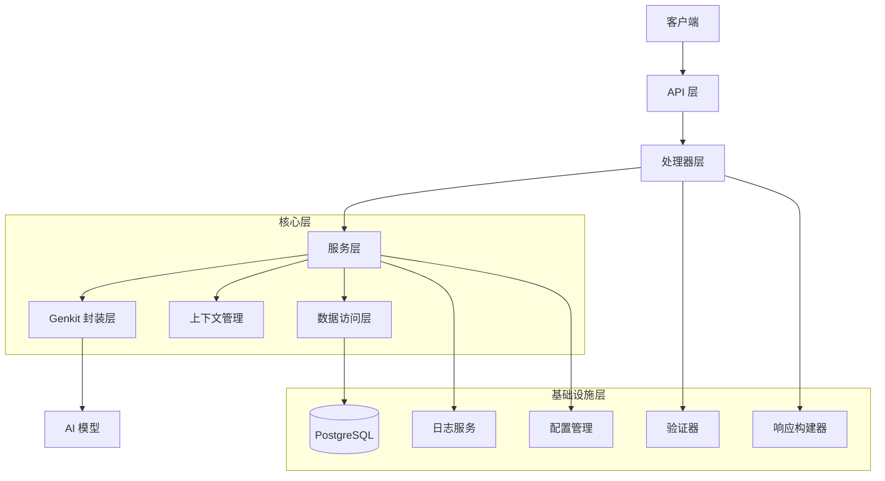

# 设计文档

## 概述

本项目基于 Firebase Genkit 框架构建一个生产级的 Go 语言 AI 服务。系统采用分层架构设计，遵循清晰的职责分离原则，确保代码的可维护性和可扩展性。

核心设计理念：

- **模块化**：各功能模块独立，便于测试和维护
- **可扩展**：为未来的 RAG、Deep Research 等高级功能预留扩展点
- **标准化**：统一的 API 响应格式和错误处理机制
- **生产就绪**：完善的日志、监控和错误处理

## 架构

### 整体架构图



### 分层说明

1. **API 层**：HTTP 路由和中间件
2. **处理器层**：请求处理、参数验证、响应构建
3. **服务层**：业务逻辑实现
4. **Genkit 封装层**：Genkit SDK 的抽象封装
5. **数据访问层**：数据库操作的抽象（预留用于未来功能）
6. **基础设施层**：日志、配置、验证、数据库连接等通用功能

## 项目结构

```
genkit-ai-service/
├── cmd/
│   └── server/
│       └── main.go                 # 应用入口
├── internal/
│   ├── api/
│   │   ├── handler/
│   │   │   ├── chat.go            # 对话处理器
│   │   │   ├── abort.go           # 中止处理器
│   │   │   └── health.go          # 健康检查处理器
│   │   ├── middleware/
│   │   │   ├── logger.go          # 日志中间件
│   │   │   ├── recovery.go        # 恢复中间件
│   │   │   └── cors.go            # CORS 中间件
│   │   └── router.go              # 路由配置
│   ├── service/
│   │   ├── ai/
│   │   │   ├── service.go         # AI 服务接口定义
│   │   │   ├── genkit_service.go  # Genkit 实现
│   │   │   └── context_manager.go # 上下文管理
│   │   └── health/
│   │       └── service.go         # 健康检查服务
│   ├── repository/
│   │   └── repository.go          # 数据库访问层（预留）
│   ├── genkit/
│   │   ├── client.go              # Genkit 客户端封装
│   │   ├── config.go              # Genkit 配置
│   │   └── flow.go                # Flow 定义
│   ├── database/
│   │   ├── postgres.go            # PostgreSQL 连接管理
│   │   └── migration.go           # 数据库迁移（预留）
│   ├── model/
│   │   ├── request.go             # 请求模型
│   │   ├── response.go            # 响应模型
│   │   └── ai.go                  # AI 相关模型
│   ├── config/
│   │   └── config.go              # 配置管理
│   └── logger/
│       └── logger.go              # 日志管理
├── pkg/
│   ├── response/
│   │   └── response.go            # 统一响应构建器
│   ├── validator/
│   │   └── validator.go           # 参数验证器
│   └── errors/
│       └── errors.go              # 错误定义
├── go.mod
├── go.sum
├── .env                            # 环境变量配置
├── .env.example                    # 环境变量示例
└── README.md
```

## 组件和接口

### 1. 响应数据结构

```go
// ResponseData 通用响应数据结构
type ResponseData[T any] struct {
    Code    int    `json:"code"`
    Message string `json:"message"`
    Data    *T     `json:"data,omitempty"`
}

// PaginationData 分页数据结构
type PaginationData[T any] struct {
    Data       T   `json:"data"`
    PageNo     int `json:"pageNo"`
    PageSize   int `json:"pageSize"`
    TotalCount int `json:"totalCount"`
    TotalPage  int `json:"totalPage"`
}

// ResponsePaginationData 分页响应数据结构
type ResponsePaginationData[T any] struct {
    Code    int                `json:"code"`
    Message string             `json:"message"`
    Data    PaginationData[T]  `json:"data"`
}
```

### 2. AI 服务接口

```go
// AIService AI 服务接口
type AIService interface {
    // Chat 发起对话
    Chat(ctx context.Context, req *ChatRequest) (*ChatResponse, error)
    
    // ChatStream 流式对话
    ChatStream(ctx context.Context, req *ChatRequest) (<-chan StreamChunk, error)
    
    // AbortChat 中止对话
    AbortChat(ctx context.Context, sessionID string) error
}

// ChatRequest 对话请求
type ChatRequest struct {
    Message   string              `json:"message" validate:"required"`
    SessionID string              `json:"sessionId,omitempty"`
    Options   *ChatOptions        `json:"options,omitempty"`
}

// ChatOptions AI 高级参数
type ChatOptions struct {
    Temperature *float64 `json:"temperature,omitempty" validate:"omitempty,gte=0,lte=2"`
    MaxTokens   *int     `json:"maxTokens,omitempty" validate:"omitempty,gt=0"`
    TopP        *float64 `json:"topP,omitempty" validate:"omitempty,gte=0,lte=1"`
    TopK        *int     `json:"topK,omitempty" validate:"omitempty,gt=0"`
}

// ChatResponse 对话响应
type ChatResponse struct {
    SessionID string `json:"sessionId"`
    Message   string `json:"message"`
    Model     string `json:"model"`
    Usage     *Usage `json:"usage,omitempty"`
}

// Usage token 使用情况
type Usage struct {
    PromptTokens     int `json:"promptTokens"`
    CompletionTokens int `json:"completionTokens"`
    TotalTokens      int `json:"totalTokens"`
}

// StreamChunk 流式响应块
type StreamChunk struct {
    Content string `json:"content"`
    Done    bool   `json:"done"`
    Error   error  `json:"error,omitempty"`
}
```

### 3. 上下文管理器

```go
// ContextManager 上下文管理器接口
type ContextManager interface {
    // CreateSession 创建新会话
    CreateSession(ctx context.Context) (string, context.Context, context.CancelFunc)
    
    // GetSession 获取会话上下文
    GetSession(sessionID string) (context.Context, bool)
    
    // CancelSession 取消会话
    CancelSession(sessionID string) error
    
    // CleanupSession 清理会话
    CleanupSession(sessionID string)
}
```

### 4. Genkit 客户端封装

```go
// GenkitClient Genkit 客户端接口
type GenkitClient interface {
    // Initialize 初始化客户端
    Initialize(ctx context.Context, config *GenkitConfig) error
    
    // Generate 生成内容
    Generate(ctx context.Context, prompt string, options *GenerateOptions) (*GenerateResult, error)
    
    // GenerateStream 流式生成内容
    GenerateStream(ctx context.Context, prompt string, options *GenerateOptions) (<-chan string, error)
}

// GenkitConfig Genkit 配置
type GenkitConfig struct {
    APIKey       string
    Model        string
    DefaultModel string
}

// GenerateOptions 生成选项
type GenerateOptions struct {
    Temperature *float64
    MaxTokens   *int
    TopP        *float64
    TopK        *int
}
```

### 5. 数据库连接管理

```go
// Database 数据库接口
type Database interface {
    // Connect 连接数据库
    Connect(ctx context.Context, config *DatabaseConfig) error
    
    // Close 关闭数据库连接
    Close() error
    
    // Ping 检查数据库连接
    Ping(ctx context.Context) error
    
    // GetDB 获取数据库实例
    GetDB() *sql.DB
}

// PostgresDatabase PostgreSQL 数据库实现
type PostgresDatabase struct {
    db *sql.DB
}
```

**说明**：

- 当前阶段数据库连接主要用于健康检查和为未来功能做准备
- 数据库连接参数从 `.env` 文件中读取
- 未来可用于存储对话历史、RAG 文档索引、用户配置等数据
- 具体的数据表结构将在后续需要时设计和实现

## 数据模型

### 请求模型

```go
// ChatRequest 对话请求
type ChatRequest struct {
    Message   string       `json:"message" validate:"required"`
    SessionID string       `json:"sessionId,omitempty"`
    Options   *ChatOptions `json:"options,omitempty"`
}

// AbortRequest 中止请求
type AbortRequest struct {
    SessionID string `json:"sessionId" validate:"required"`
}
```

### 响应模型

所有 API 响应都遵循统一的 `ResponseData[T]` 格式，确保客户端可以统一处理响应。

## 错误处理

### 错误码体系

```go
const (
    // 成功
    CodeSuccess = 200
    
    // 客户端错误 4xx
    CodeBadRequest          = 400  // 请求参数错误
    CodeUnauthorized        = 401  // 未授权
    CodeForbidden           = 403  // 禁止访问
    CodeNotFound            = 404  // 资源不存在
    CodeValidationError     = 422  // 参数验证失败
    
    // 服务器错误 5xx
    CodeInternalError       = 500  // 内部错误
    CodeServiceUnavailable  = 503  // 服务不可用
    CodeAIServiceError      = 550  // AI 服务错误
    CodeContextCancelled    = 551  // 上下文已取消
)
```

### 错误处理流程

1. **参数验证错误**：返回 422 状态码，包含详细的验证错误信息
2. **业务逻辑错误**：返回相应的业务错误码和描述
3. **系统错误**：返回 500 状态码，记录详细日志但不暴露内部细节
4. **AI 服务错误**：返回 550 状态码，包含 AI 服务的错误信息

### 错误响应示例

```json
{
  "code": 422,
  "message": "参数验证失败",
  "data": {
    "errors": [
      {
        "field": "temperature",
        "message": "温度值必须在 0 到 2 之间"
      }
    ]
  }
}
```

## API 接口设计

### 1. 对话接口

**端点**：`POST /api/v1/chat`

**请求体**：

```json
{
  "message": "你好，请介绍一下 Firebase",
  "sessionId": "optional-session-id",
  "options": {
    "temperature": 0.7,
    "maxTokens": 1000,
    "topP": 0.9,
    "topK": 40
  }
}
```

**响应**：

```json
{
  "code": 200,
  "message": "成功",
  "data": {
    "sessionId": "generated-session-id",
    "message": "Firebase 是 Google 提供的...",
    "model": "gemini-2.5-flash",
    "usage": {
      "promptTokens": 10,
      "completionTokens": 50,
      "totalTokens": 60
    }
  }
}
```

### 2. 流式对话接口（可选）

**端点**：`POST /api/v1/chat/stream`

**响应**：Server-Sent Events (SSE) 流

```
data: {"content": "Firebase ", "done": false}
data: {"content": "是 ", "done": false}
data: {"content": "Google...", "done": true}
```

### 3. 中止接口

**端点**：`POST /api/v1/chat/abort`

**请求体**：

```json
{
  "sessionId": "session-id-to-abort"
}
```

**响应**：

```json
{
  "code": 200,
  "message": "对话已成功中止",
  "data": null
}
```

### 4. 健康检查接口

**端点**：`GET /health`

**响应**：

```json
{
  "code": 200,
  "message": "服务正常",
  "data": {
    "status": "healthy",
    "version": "1.0.0",
    "uptime": "2h30m15s",
    "dependencies": {
      "genkit": "connected",
      "database": "connected"
    }
  }
}
```

## 配置管理

### 环境变量

```bash
# 服务配置
SERVER_PORT=8080
SERVER_HOST=0.0.0.0

# Genkit 配置
GENKIT_API_KEY=your-api-key
GENKIT_MODEL=gemini-2.5-flash
GENKIT_DEFAULT_TEMPERATURE=0.7
GENKIT_DEFAULT_MAX_TOKENS=2000

# PostgreSQL 数据库配置
DB_HOST=localhost
DB_PORT=5432
DB_USER=postgres
DB_PASSWORD=your-password
DB_NAME=genkit_ai_service
DB_SSLMODE=disable
DB_MAX_OPEN_CONNS=25
DB_MAX_IDLE_CONNS=5
DB_CONN_MAX_LIFETIME=5m

# 日志配置
LOG_LEVEL=info
LOG_FORMAT=json

# 会话配置
SESSION_TIMEOUT=30m
SESSION_CLEANUP_INTERVAL=5m
```

### 配置结构

```go
type Config struct {
    Server   ServerConfig
    Genkit   GenkitConfig
    Database DatabaseConfig
    Log      LogConfig
    Session  SessionConfig
}

type ServerConfig struct {
    Port string
    Host string
}

type GenkitConfig struct {
    APIKey             string
    Model              string
    DefaultTemperature float64
    DefaultMaxTokens   int
}

type DatabaseConfig struct {
    Host            string
    Port            string
    User            string
    Password        string
    DBName          string
    SSLMode         string
    MaxOpenConns    int
    MaxIdleConns    int
    ConnMaxLifetime time.Duration
}

type LogConfig struct {
    Level  string
    Format string
}

type SessionConfig struct {
    Timeout         time.Duration
    CleanupInterval time.Duration
}
```

## 日志策略

### 日志级别

- **DEBUG**：详细的调试信息
- **INFO**：一般信息，如请求日志
- **WARN**：警告信息，如参数异常但可处理
- **ERROR**：错误信息，如 AI 服务调用失败

### 日志内容

1. **请求日志**：记录所有 API 请求的基本信息
   - 请求方法、路径、参数
   - 客户端 IP
   - 响应状态码和耗时

2. **业务日志**：记录关键业务操作
   - AI 对话请求和响应
   - 会话创建和销毁
   - 错误和异常情况

3. **性能日志**：记录性能指标
   - API 响应时间
   - AI 模型调用耗时
   - 资源使用情况

### 日志格式

使用结构化日志（JSON 格式），便于日志收集和分析：

```json
{
  "timestamp": "2025-10-15T10:30:00Z",
  "level": "info",
  "message": "AI chat request",
  "sessionId": "abc123",
  "model": "gemini-2.5-flash",
  "duration": "1.5s",
  "tokens": 60
}
```

## 测试策略

### 单元测试

- **服务层测试**：测试业务逻辑，使用 mock 隔离依赖
- **处理器测试**：测试请求处理和响应构建
- **工具函数测试**：测试验证器、响应构建器等工具函数

### 集成测试

- **API 测试**：测试完整的 HTTP 请求-响应流程
- **Genkit 集成测试**：测试与 Genkit SDK 的集成

### 测试覆盖率目标

- 核心业务逻辑：>80%
- 工具函数：>90%
- 整体覆盖率：>70%

## 扩展性设计

### 插件机制

为未来的高级功能（RAG、Deep Research）预留扩展点：

```go
// AIPlugin AI 功能插件接口
type AIPlugin interface {
    Name() string
    Initialize(ctx context.Context, config map[string]interface{}) error
    Process(ctx context.Context, input *PluginInput) (*PluginOutput, error)
}

// PluginManager 插件管理器
type PluginManager interface {
    RegisterPlugin(plugin AIPlugin) error
    GetPlugin(name string) (AIPlugin, error)
    ExecutePlugin(ctx context.Context, name string, input *PluginInput) (*PluginOutput, error)
}
```

### 未来扩展方向

1. **RAG（检索增强生成）**
   - 向量数据库集成
   - 文档索引和检索
   - 上下文增强

2. **Deep Research**
   - 多步骤推理
   - 信息聚合
   - 结果验证

3. **多模态支持**
   - 图像输入/输出
   - 音频处理
   - 视频分析

4. **高级对话管理**
   - 对话历史持久化
   - 多轮对话上下文
   - 对话分析和优化

## 部署考虑

### 容器化

使用 Docker 容器化部署：

```dockerfile
FROM golang:1.21-alpine AS builder
WORKDIR /app
COPY . .
RUN go build -o server cmd/server/main.go

FROM alpine:latest
WORKDIR /app
COPY --from=builder /app/server .
EXPOSE 8080
CMD ["./server"]
```

### 环境支持

- **本地开发**：直接运行 Go 程序
- **Cloud Run**：无服务器容器部署
- **Kubernetes**：容器编排部署
- **传统服务器**：编译后的二进制文件部署

### 监控和可观测性

- **健康检查**：提供 `/health` 端点
- **指标收集**：集成 Prometheus 指标
- **分布式追踪**：支持 OpenTelemetry
- **日志聚合**：结构化日志便于收集

## 安全考虑

1. **API 密钥管理**：使用环境变量，不硬编码
2. **输入验证**：严格验证所有用户输入
3. **速率限制**：防止 API 滥用
4. **CORS 配置**：合理配置跨域访问
5. **错误信息**：不暴露敏感的内部信息
