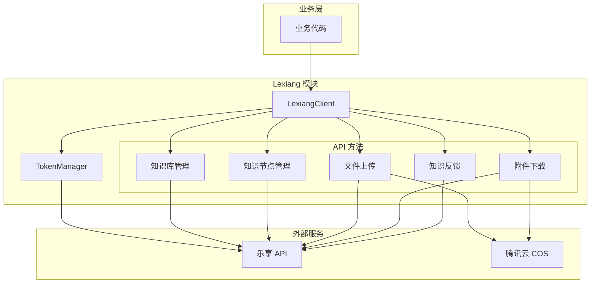
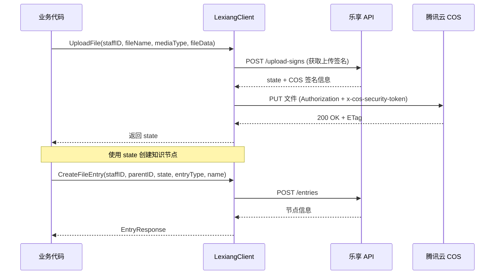
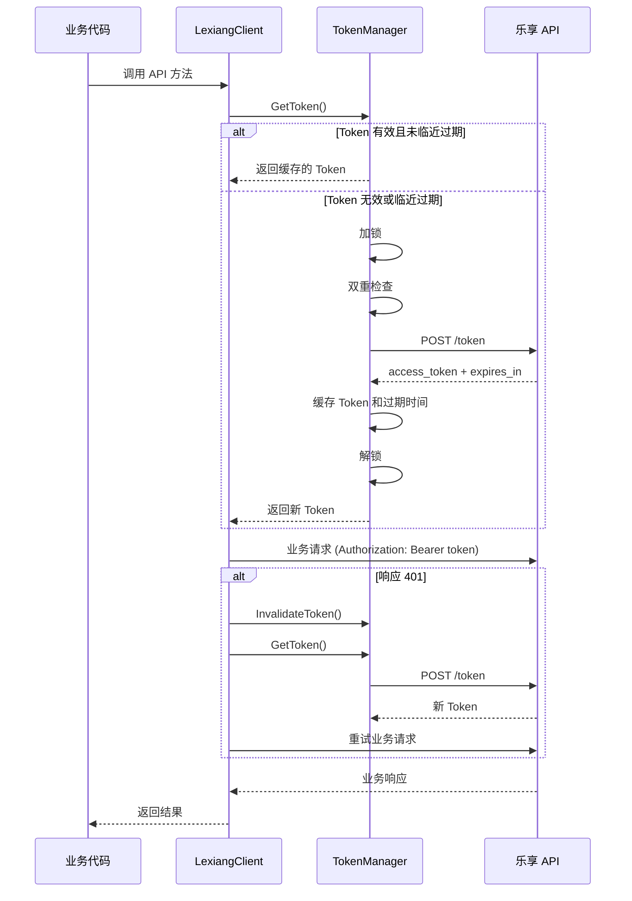

# 设计文档

## 概述

本设计文档描述腾讯乐享知识库 API 集成模块的技术实现方案。该模块采用分层架构，核心组件包括 TokenManager（Token 管理器）和 LexiangClient（API 客户端），提供对乐享 API 的完整封装。

### 设计目标

1. **业务无感的 Token 管理** - 自动处理 token 的获取、缓存、刷新和重试
2. **类型安全** - 使用 Go 结构体定义所有请求和响应类型
3. **并发安全** - 支持多 goroutine 并发调用
4. **可测试性** - 支持依赖注入，便于单元测试

## 架构



### 文件上传流程



### Token 管理流程



## 组件和接口

### 目录结构

```text
pkg/lexiang/
├── client.go              # LexiangClient 实现
├── token_manager.go       # TokenManager 实现
├── types.go               # 类型定义（常量、枚举、结构体）
├── space.go               # 知识库管理方法
├── entry.go               # 知识节点管理方法
├── upload.go              # 文件上传方法
├── download.go            # 附件下载方法
├── feedback.go            # 知识反馈方法
├── errors.go              # 错误处理
├── client_test.go         # 单元测试
├── token_manager_test.go  # TokenManager 测试
└── property_test.go       # 属性测试
```

### TokenManager 接口

```go
// TokenManager Token 管理器接口
type TokenManager interface {
    // GetToken 获取有效的 access_token（自动处理刷新）
    GetToken(ctx context.Context) (string, error)
    
    // InvalidateToken 强制使 token 失效（用于 401 重试场景）
    InvalidateToken()
}
```

### LexiangClient 接口

```go
// LexiangClient 乐享 API 客户端接口
type LexiangClient interface {
    // HTTP 方法
    Do(ctx context.Context, method, path string, body any) (*http.Response, error)
    DoWithHeader(ctx context.Context, method, path string, body any, headers map[string]string) (*http.Response, error)
    Get(ctx context.Context, path string) (*http.Response, error)
    Post(ctx context.Context, path string, body any) (*http.Response, error)
    Put(ctx context.Context, path string, body any) (*http.Response, error)
    Delete(ctx context.Context, path string) (*http.Response, error)
    
    // 知识库管理
    CreateSpace(ctx context.Context, staffID, teamID, name string) (*SpaceResponse, error)
    UpdateSpace(ctx context.Context, staffID, spaceID, name string) (*SpaceResponse, error)
    DeleteSpace(ctx context.Context, staffID, spaceID string) error
    ListSpaces(ctx context.Context, teamID string, limit int, pageToken string) (*SpaceListResponse, error)
    GetSpace(ctx context.Context, spaceID string) (*SpaceResponse, error)
    
    // 知识节点管理
    CreateFolder(ctx context.Context, staffID, parentID, name string) (*EntryResponse, error)
    CreateFileEntry(ctx context.Context, staffID, parentID, state string, entryType EntryType, name string) (*EntryResponse, error)
    ReuploadFile(ctx context.Context, staffID, entryID, state string) error
    DeleteEntry(ctx context.Context, staffID, entryID string) error
    ListEntries(ctx context.Context, spaceID, parentID string, limit int, pageToken string) (*EntryListResponse, error)
    GetEntry(ctx context.Context, entryID string) (*EntryResponse, error)
    GetEntryContent(ctx context.Context, entryID string) (*EntryContentResponse, error)
    
    // 文件上传
    GetUploadSign(ctx context.Context, staffID, fileName, mediaType string) (*UploadSignResponse, error)
    UploadFileToCOS(ctx context.Context, sign *UploadSignResponse, fileData []byte) error
    UploadFile(ctx context.Context, staffID, fileName, mediaType string, fileData []byte) (string, error)
    
    // 附件下载
    GetDocFile(ctx context.Context, fileID string) (*DocFileResponse, error)
    DownloadDocFile(ctx context.Context, fileID string) ([]byte, string, error)
    
    // 知识反馈
    ListFeedbacks(ctx context.Context, spaceID string, limit int, pageToken string) (*FeedbackListResponse, error)
}
```

## 数据模型

### 常量定义

```go
const (
    LexiangBaseURL  = "https://lxapi.lexiangla.com/cgi-bin"
    LexiangTokenURL = "https://lxapi.lexiangla.com/cgi-bin/token"
    LexiangAPIURL   = "https://lxapi.lexiangla.com/cgi-bin/v1"
    
    DefaultTimeout       = 30 * time.Second
    TokenRefreshBuffer   = 5 * time.Minute
)

// EntryType 知识节点类型
type EntryType string

const (
    EntryTypeFolder     EntryType = "folder"
    EntryTypeFile       EntryType = "file"
    EntryTypeVideo      EntryType = "video"
    EntryTypeAudio      EntryType = "audio"
    EntryTypeLink       EntryType = "link"
    EntryTypePage       EntryType = "page"
    EntryTypeSmartsheet EntryType = "smartsheet"
)

// SpaceRole 知识库角色
type SpaceRole string

const (
    SpaceRoleNone       SpaceRole = "none"
    SpaceRoleViewer     SpaceRole = "viewer"
    SpaceRoleDownloader SpaceRole = "downloader"
    SpaceRoleEditor     SpaceRole = "editor"
    SpaceRoleManager    SpaceRole = "manager"
    SpaceRoleDefault    SpaceRole = "default"
)

// FeedbackStatus 反馈状态
type FeedbackStatus string

const (
    FeedbackStatusUnprocessed FeedbackStatus = "unprocessed"
    FeedbackStatusProcessing  FeedbackStatus = "processing"
    FeedbackStatusProcessed   FeedbackStatus = "processed"
    FeedbackStatusNotProcess  FeedbackStatus = "not_process"
)

// FeedbackType 反馈类型
type FeedbackType string

const (
    FeedbackTypeIncomplete FeedbackType = "kb_content_incomplete"
    FeedbackTypeMistake    FeedbackType = "kb_content_mistake"
    FeedbackTypeSuggestion FeedbackType = "kb_content_suggestion"
    FeedbackTypeTooOld     FeedbackType = "kb_content_too_old"
    FeedbackTypeOther      FeedbackType = "kb_content_other"
)
```

### 配置结构体

```go
// Config 乐享客户端配置
type Config struct {
    AppKey         string        // 应用 Key（必填）
    AppSecret      string        // 应用 Secret（必填）
    BaseURL        string        // API 基础 URL（可选，默认为官方地址）
    Timeout        time.Duration // HTTP 超时时间（可选，默认 30 秒）
    RefreshBuffer  time.Duration // Token 提前刷新时间（可选，默认 5 分钟）
}

// DefaultConfig 返回默认配置
func DefaultConfig() *Config {
    return &Config{
        BaseURL:       LexiangBaseURL,
        Timeout:       DefaultTimeout,
        RefreshBuffer: TokenRefreshBuffer,
    }
}
```

### Token 相关结构体

```go
// tokenRequest Token 请求
type tokenRequest struct {
    GrantType string `json:"grant_type"`
    AppKey    string `json:"app_key"`
    AppSecret string `json:"app_secret"`
}

// tokenResponse Token 响应
type tokenResponse struct {
    TokenType   string `json:"token_type"`
    ExpiresIn   int    `json:"expires_in"`
    AccessToken string `json:"access_token"`
}
```

### 知识库相关结构体

```go
// CreateSpaceRequest 创建知识库请求
type CreateSpaceRequest struct {
    Data struct {
        Attributes struct {
            Name               string    `json:"name"`
            Logo               string    `json:"logo,omitempty"`
            VisibleType        int       `json:"visible_type,omitempty"`
            ManagerInheritType SpaceRole `json:"manager_inherit_type,omitempty"`
            MemberInheritType  SpaceRole `json:"member_inherit_type,omitempty"`
        } `json:"attributes"`
        Relationships struct {
            Team struct {
                Data struct {
                    ID string `json:"id"`
                } `json:"data"`
            } `json:"team"`
        } `json:"relationships"`
    } `json:"data"`
}

// SpaceResponse 知识库响应
type SpaceResponse struct {
    Data struct {
        Type       string `json:"type"`
        ID         string `json:"id"`
        Attributes struct {
            Name               string `json:"name"`
            Logo               string `json:"logo"`
            VisibleType        int    `json:"visible_type"`
            ManagerInheritType string `json:"manager_inherit_type"`
            MemberInheritType  string `json:"member_inherit_type"`
        } `json:"attributes"`
        Relationships struct {
            Team struct {
                Data struct {
                    ID string `json:"id"`
                } `json:"data"`
            } `json:"team"`
            RootEntry struct {
                Data struct {
                    ID string `json:"id"`
                } `json:"data"`
            } `json:"root_entry"`
        } `json:"relationships"`
    } `json:"data"`
}

// SpaceListResponse 知识库列表响应
type SpaceListResponse struct {
    Data []struct {
        Type       string `json:"type"`
        ID         string `json:"id"`
        Attributes struct {
            Name string `json:"name"`
            Logo string `json:"logo"`
        } `json:"attributes"`
        Relationships struct {
            RootEntry struct {
                Data struct {
                    ID string `json:"id"`
                } `json:"data"`
            } `json:"root_entry"`
        } `json:"relationships"`
    } `json:"data"`
    Meta struct {
        PageToken string `json:"page_token"`
    } `json:"meta"`
}
```

### 知识节点相关结构体

```go
// EntryResponse 知识节点响应
type EntryResponse struct {
    Data struct {
        Type       string `json:"type"`
        ID         string `json:"id"`
        Attributes struct {
            Name              string `json:"name"`
            EntryType         string `json:"entry_type"`
            HasChildren       bool   `json:"has_children"`
            CreatedAt         string `json:"created_at"`
            UpdatedAt         string `json:"updated_at"`
            MemberInheritType string `json:"member_inherit_type"`
        } `json:"attributes"`
        Links struct {
            Download string `json:"download"`
        } `json:"links"`
    } `json:"data"`
}

// EntryListResponse 知识节点列表响应
type EntryListResponse struct {
    Data []struct {
        Type       string `json:"type"`
        ID         string `json:"id"`
        Attributes struct {
            Name        string `json:"name"`
            EntryType   string `json:"entry_type"`
            HasChildren bool   `json:"has_children"`
        } `json:"attributes"`
    } `json:"data"`
    Meta struct {
        PageToken string `json:"page_token"`
    } `json:"meta"`
}

// EntryContentResponse 线上文档内容响应
type EntryContentResponse struct {
    Name        string `json:"name"`
    HTMLContent string `json:"html_content"`
}

// CreateEntryRequest 创建知识节点请求
type CreateEntryRequest struct {
    Name          string    `json:"name,omitempty"`
    State         string    `json:"state,omitempty"`
    EntryType     EntryType `json:"entry_type"`
    Relationships struct {
        ParentEntry struct {
            Data struct {
                ID string `json:"id"`
            } `json:"data"`
        } `json:"parent_entry"`
    } `json:"relationships"`
}
```

### 文件上传相关结构体

```go
// UploadSignRequest 获取上传签名请求
type UploadSignRequest struct {
    Name      string `json:"name"`
    MediaType string `json:"media_type"`
}

// UploadSignResponse 获取上传签名响应
type UploadSignResponse struct {
    State  string `json:"state"`
    Object struct {
        Key     string `json:"key"`
        Options struct {
            Bucket string `json:"bucket"`
            Region string `json:"region"`
        } `json:"options"`
        Auth struct {
            Authorization     string `json:"Authorization"`
            XCosSecurityToken string `json:"XCosSecurityToken"`
        } `json:"auth"`
        Headers struct {
            ContentDisposition string `json:"Content-Disposition"`
        } `json:"headers"`
    } `json:"object"`
}
```

### 附件下载相关结构体

```go
// DocFileResponse 附件详情响应
type DocFileResponse struct {
    Data struct {
        Type       string `json:"type"`
        ID         string `json:"id"`
        Attributes struct {
            Name string `json:"name"`
        } `json:"attributes"`
        Links struct {
            Download string `json:"download"`
        } `json:"links"`
    } `json:"data"`
}
```

### 知识反馈相关结构体

```go
// FeedbackListResponse 反馈列表响应
type FeedbackListResponse struct {
    Data []struct {
        Type       string `json:"type"`
        ID         string `json:"id"`
        Attributes struct {
            Status     string `json:"status"`
            Type       string `json:"type"`
            Content    string `json:"content"`
            CreatedAt  string `json:"created_at"`
            ReviewedAt string `json:"reviewed_at"`
        } `json:"attributes"`
        Relationships struct {
            Owner struct {
                Data struct {
                    ID string `json:"id"`
                } `json:"data"`
            } `json:"owner"`
            Entry struct {
                Data struct {
                    ID string `json:"id"`
                } `json:"data"`
            } `json:"entry"`
        } `json:"relationships"`
    } `json:"data"`
    Included []struct {
        Type       string         `json:"type"`
        ID         string         `json:"id"`
        Attributes map[string]any `json:"attributes"`
    } `json:"included"`
    Meta struct {
        PageToken string `json:"page_token"`
    } `json:"meta"`
}
```

## 正确性属性

*属性是系统在所有有效执行中应保持为真的特征或行为——本质上是关于系统应该做什么的形式化陈述。属性作为人类可读规范和机器可验证正确性保证之间的桥梁。*

### Property 1: Token 缓存一致性

*对于任意* TokenManager 实例，如果 token 有效且距离过期时间大于 5 分钟，则 GetToken 应返回缓存的 token 而不发起新的 API 请求

**Validates: Requirements 1.1, 1.2**

### Property 2: Token 刷新并发安全

*对于任意* 数量的并发 GetToken 调用，当 token 需要刷新时，应仅执行一次 token API 请求

**Validates: Requirements 1.3**

### Property 3: 401 自动重试

*对于任意* API 请求，当收到 401 响应时，客户端应使 token 失效、获取新 token 并重试请求一次

**Validates: Requirements 1.4**

### Property 4: 请求头自动设置

*对于任意* HTTP 请求，请求头应包含正确的 Authorization Bearer token 和 Content-Type application/json

**Validates: Requirements 2.2, 2.3**

### Property 5: 自定义请求头传递

*对于任意* DoWithHeader 调用，传入的自定义请求头应被正确添加到 HTTP 请求中

**Validates: Requirements 2.4**

### Property 6: API 请求格式正确性

*对于任意* 知识库或知识节点管理方法调用，发送的 HTTP 请求应符合乐享 API 规范的格式要求

**Validates: Requirements 3.1, 3.2, 3.3, 3.4, 3.5, 4.1, 4.2, 4.3, 4.4, 4.5, 4.6, 4.7**

### Property 7: 分页参数传递

*对于任意* 列表查询方法调用，分页参数（limit, pageToken）应被正确拼接到查询字符串中

**Validates: Requirements 3.4, 4.5, 7.1**

### Property 8: 上传签名响应 Round-Trip

*对于任意* 有效的 UploadSignResponse JSON，解析后再序列化应产生等价的 JSON 结构

**Validates: Requirements 5.5, 5.6**

### Property 9: COS 上传请求头正确性

*对于任意* UploadFileToCOS 调用，请求头应包含签名信息中的 Authorization 和 x-cos-security-token

**Validates: Requirements 5.2**

### Property 10: 错误状态码映射

*对于任意* HTTP 错误响应（400, 403, 404, 429, 500），返回的错误应包含对应的错误类型信息

**Validates: Requirements 8.1, 8.2, 8.3, 8.4, 8.5**

## 错误处理

### 错误类型定义

```go
// LexiangError 乐享 API 错误
type LexiangError struct {
    StatusCode int
    Code       string
    Message    string
    RawBody    string
}

func (e *LexiangError) Error() string {
    return fmt.Sprintf("lexiang api error: status=%d, code=%s, message=%s", 
        e.StatusCode, e.Code, e.Message)
}

// 错误类型判断函数
func IsBadRequestError(err error) bool
func IsForbiddenError(err error) bool
func IsNotFoundError(err error) bool
func IsRateLimitError(err error) bool
func IsServerError(err error) bool
```

### 错误处理策略

| HTTP 状态码 | 错误类型 | 处理策略 |
|-------------|----------|----------|
| 400 | BadRequest | 返回错误，不重试 |
| 401 | Unauthorized | 刷新 token 并重试一次 |
| 403 | Forbidden | 返回错误，不重试 |
| 404 | NotFound | 返回错误，不重试 |
| 429 | RateLimit | 返回错误，建议调用方延迟重试 |
| 500+ | ServerError | 返回错误，建议调用方重试 |

## 测试策略

### 单元测试

使用 `httptest` 包模拟 HTTP 服务器进行单元测试：

1. **TokenManager 测试**
   - 测试首次获取 token
   - 测试 token 缓存命中
   - 测试 token 自动刷新
   - 测试并发获取 token

2. **LexiangClient 测试**
   - 测试请求头设置
   - 测试 401 自动重试
   - 测试各种 HTTP 方法

3. **业务方法测试**
   - 测试知识库 CRUD
   - 测试知识节点 CRUD
   - 测试文件上传流程
   - 测试附件下载流程

### 属性测试

使用 `github.com/leanovate/gopter` 库进行属性测试：

1. **Token 缓存一致性测试** - 验证 token 缓存行为
2. **并发安全测试** - 验证多 goroutine 并发调用
3. **Round-Trip 测试** - 验证 JSON 序列化/反序列化一致性
4. **错误映射测试** - 验证错误状态码映射

### 测试配置

```go
// 属性测试配置：最少运行 100 次迭代
const PropertyTestIterations = 100
```

## 环境变量配置

模块支持从环境变量读取配置：

| 环境变量 | 说明 | 必填 |
|----------|------|------|
| `LEXIANG_APP_KEY` | 乐享应用 Key | 是 |
| `LEXIANG_APP_SECRET` | 乐享应用 Secret | 是 |

## 使用示例

```go
package main

import (
    "context"
    "fmt"
    "log"
    "os"
    
    "ai-data-go/pkg/lexiang"
)

func main() {
    // 方式1：从环境变量创建客户端
    client := lexiang.NewClientFromEnv()
    
    // 方式2：使用配置创建客户端
    // client := lexiang.NewClient(&lexiang.Config{
    //     AppKey:    "your_app_key",
    //     AppSecret: "your_app_secret",
    // })
    
    ctx := context.Background()
    
    // 获取知识库列表
    spaces, err := client.ListSpaces(ctx, "team_id", 10, "")
    if err != nil {
        log.Fatalf("获取知识库列表失败: %v", err)
    }
    
    for _, space := range spaces.Data {
        fmt.Printf("知识库: %s (%s)\n", space.Attributes.Name, space.ID)
    }
    
    // 上传文件
    fileData, _ := os.ReadFile("/path/to/document.pdf")
    state, err := client.UploadFile(ctx, "staff123", "document.pdf", "file", fileData)
    if err != nil {
        log.Fatalf("上传文件失败: %v", err)
    }
    
    // 创建知识节点
    entry, err := client.CreateFileEntry(ctx, "staff123", "parent_id", state, lexiang.EntryTypeFile, "")
    if err != nil {
        log.Fatalf("创建知识节点失败: %v", err)
    }
    fmt.Printf("创建成功，节点ID: %s\n", entry.Data.ID)
}
```

## 注意事项

1. **频率限制**：获取 token 接口限制 20次/10分钟，本方案通过缓存和提前刷新避免频繁调用
2. **密钥安全**：AppSecret 不要提交到代码仓库，使用环境变量管理
3. **文件大小**：单文件最大 5GB，建议 100MB 以内
4. **state 时效**：上传签名返回的 state 有时效性，需尽快使用
5. **删除节点**：删除节点前需确保节点下没有子节点
