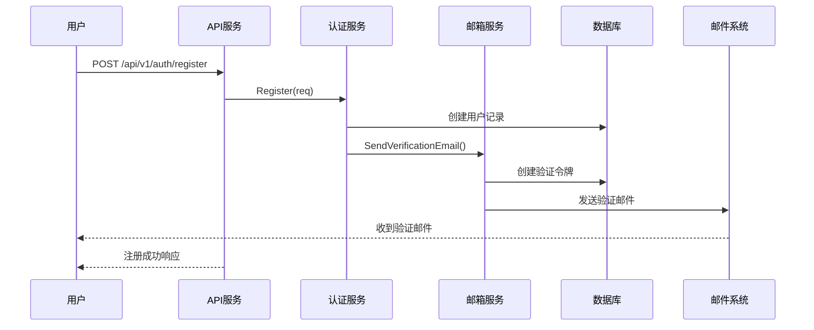
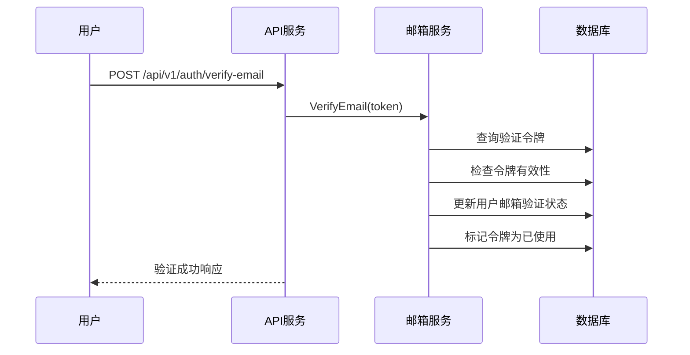

# 邮箱验证功能文档

## 概述

邮箱验证功能允许系统验证用户注册时提供的邮箱地址是否真实有效。用户注册后，系统会发送一封包含验证链接的邮件，用户点击链接后即可完成邮箱验证。

## 功能特性

- ✅ 生成安全的验证令牌（UUID格式）
- ✅ 发送验证邮件（支持HTML格式）
- ✅ 验证令牌有效期管理（默认24小时）
- ✅ 防止令牌重复使用
- ✅ 自动清理过期令牌
- ✅ 支持重新发送验证邮件

## 数据库表结构

### email_verification_tokens 表

| 字段名 | 类型 | 说明 |
|--------|------|------|
| id | UUID | 令牌唯一标识符 |
| user_id | UUID | 用户ID |
| tenant_id | UUID | 租户ID |
| token | VARCHAR(64) | 验证令牌（唯一） |
| email | VARCHAR(320) | 邮箱地址 |
| used | BOOLEAN | 是否已使用 |
| created_at | TIMESTAMP | 创建时间 |
| expires_at | TIMESTAMP | 过期时间 |

## API 端点

### 1. 发送验证邮件

在用户注册时，系统会自动调用 `EmailService.SendVerificationEmail` 方法发送验证邮件。

**内部方法签名：**

```go
SendVerificationEmail(ctx context.Context, tenantID, userID, email string) error
```

### 2. 验证邮箱

**端点：** `POST /api/v1/auth/verify-email`

**请求体：**

```json
{
  "token": "550e8400-e29b-41d4-a716-446655440000"
}
```

**成功响应：** (200 OK)

```json
{
  "code": 200,
  "message": "邮箱验证成功",
  "data": null
}
```

**错误响应：**

- 400 Bad Request - 验证令牌无效或已过期
- 422 Unprocessable Entity - 参数验证失败

### 3. 重新发送验证邮件

**端点：** `POST /api/v1/auth/resend-verification`

**请求体：**

```json
{
  "tenantId": "550e8400-e29b-41d4-a716-446655440000",
  "userId": "660e8400-e29b-41d4-a716-446655440001"
}
```

**成功响应：** (200 OK)

```json
{
  "code": 200,
  "message": "验证邮件已发送",
  "data": null
}
```

**错误响应：**

- 400 Bad Request - 邮箱已验证或用户不存在
- 422 Unprocessable Entity - 参数验证失败

## 使用流程

### 用户注册流程



### 邮箱验证流程



## 配置说明

### 邮件发送器配置

系统提供两种邮件发送器实现：

#### 1. 控制台邮件发送器（开发环境）

用于开发和测试环境，将邮件内容输出到控制台而不实际发送。

```go
emailSender := auth.NewConsoleEmailSender()
```

#### 2. SMTP邮件发送器（生产环境）

用于生产环境，通过SMTP协议发送真实邮件。

```go
smtpConfig := auth.SMTPConfig{
    Host:     "smtp.example.com",
    Port:     587,
    Username: "noreply@example.com",
    Password: "your-password",
    From:     "noreply@example.com",
}
emailSender := auth.NewSMTPEmailSender(smtpConfig)
```

**注意：** 当前SMTP发送器仅提供接口定义，实际实现需要根据具体的SMTP服务配置。

### 验证令牌有效期配置

在 `main.go` 中初始化 EmailService 时配置：

```go
emailService := auth.NewEmailService(
    emailVerificationRepo,
    userRepo,
    emailSender,
    24*time.Hour, // 验证令牌有效期：24小时
)
```

## 邮件模板

### 验证邮件模板

```html
<html>
<body>
    <h2>邮箱验证</h2>
    <p>请点击下面的链接验证您的邮箱地址：</p>
    <p><a href="https://your-domain.com/verify-email?token={token}">验证邮箱</a></p>
    <p>或者复制以下链接到浏览器：</p>
    <p>https://your-domain.com/verify-email?token={token}</p>
    <p>此链接将在 24 小时后过期。</p>
    <p>如果您没有注册账户，请忽略此邮件。</p>
</body>
</html>
```

**自定义邮件模板：**

可以在 `internal/service/auth/email_service.go` 的 `SendVerificationEmail` 方法中修改邮件内容。

## 自动清理机制

系统会定期清理过期的验证令牌，清理任务由 `CleanupService` 负责。

### 清理配置

在 `main.go` 中配置清理间隔：

```go
cleanupConfig := cleanup.CleanupConfig{
    TokenCleanupInterval: 1 * time.Hour, // 每小时清理一次
}
```

### 清理逻辑

- 清理服务启动时立即执行一次清理
- 之后按配置的间隔定期执行清理
- 清理所有 `expires_at < 当前时间` 的验证令牌

## 安全考虑

### 1. 令牌安全

- 使用UUID作为验证令牌，具有足够的随机性
- 令牌存储在数据库中，不暴露给客户端
- 令牌有唯一索引，防止重复

### 2. 防止滥用

- 验证令牌有有效期限制（默认24小时）
- 令牌使用后立即标记为已使用，防止重复验证
- 可以限制重新发送验证邮件的频率（需要额外实现）

### 3. 数据隔离

- 验证令牌包含 `tenant_id` 字段，确保多租户隔离
- 验证时检查令牌的租户归属

## 测试

### 单元测试

运行邮箱验证相关的单元测试：

```bash
go test -v ./internal/service/auth -run "TestVerifyEmail|TestSendVerificationEmail"
```

### 测试覆盖

- ✅ 发送验证邮件
- ✅ 验证邮箱成功
- ✅ 使用过期令牌验证失败
- ✅ 使用已使用的令牌验证失败
- ✅ 重新发送验证邮件

## 常见问题

### Q1: 如何在生产环境中配置真实的邮件发送？

A: 需要实现 `SMTPEmailSender` 的 `SendEmail` 方法，可以使用 Go 的 `net/smtp` 包或第三方库如 `gomail`。

### Q2: 验证链接的域名如何配置？

A: 在 `internal/service/auth/email_service.go` 的 `SendVerificationEmail` 方法中修改 `verificationLink` 的域名部分。建议将域名配置化，从配置文件或环境变量读取。

### Q3: 如何自定义邮件模板？

A: 修改 `internal/service/auth/email_service.go` 中的 `SendVerificationEmail` 方法，更新 `body` 变量的内容。建议使用模板引擎（如 `html/template`）来管理邮件模板。

### Q4: 如何限制重新发送验证邮件的频率？

A: 可以在 `ResendVerificationEmail` 方法中添加频率限制逻辑，例如：

- 检查最近一次发送时间
- 如果距离上次发送不足N分钟，返回错误
- 可以使用Redis存储发送记录

### Q5: 验证令牌的有效期可以动态配置吗？

A: 可以。将有效期配置添加到 `config.AuthConfig` 结构中，然后在初始化 `EmailService` 时从配置读取。

## 扩展建议

### 1. 邮件模板管理

- 使用 `html/template` 包管理邮件模板
- 支持多语言邮件模板
- 支持自定义邮件样式

### 2. 邮件发送队列

- 使用消息队列（如RabbitMQ、Redis）异步发送邮件
- 提高API响应速度
- 支持邮件发送失败重试

### 3. 邮件发送统计

- 记录邮件发送成功/失败次数
- 监控邮件发送性能
- 生成邮件发送报表

### 4. 第三方邮件服务集成

- 集成SendGrid、Mailgun等第三方邮件服务
- 提供更好的送达率和可靠性
- 支持邮件追踪和分析

## 相关文档

- [认证系统快速参考](./AUTH_QUICK_REFERENCE.md)
- [认证系统设置指南](./AUTH_SETUP.md)
- [多租户认证需求文档](../.kiro/specs/multi-tenant-auth/requirements.md)
- [多租户认证设计文档](../.kiro/specs/multi-tenant-auth/design.md)
