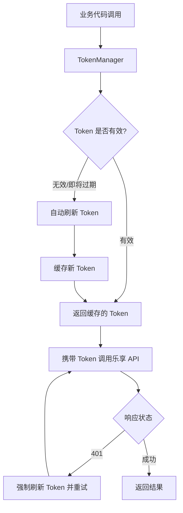
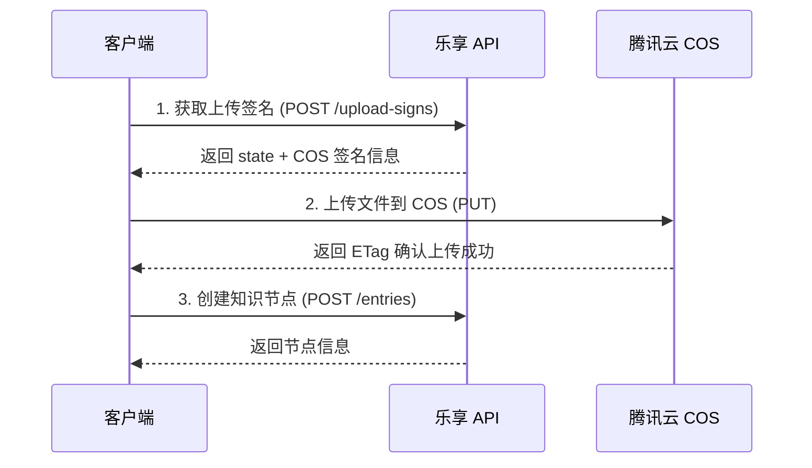

# 乐享 API 集成方案

## 概述

本文档描述如何集成腾讯乐享知识库 API，实现 access_token 的自动管理，让业务代码对 token 完全无感。

## 目录

- [API 地址](#api-地址)
- [Token 说明](#token-说明)
- [设计思路](#设计思路)
- [核心实现](#核心实现)
- [环境变量配置](#环境变量配置)
- [使用示例](#使用示例)
- [方案优势](#方案优势)
- [注意事项](#注意事项)
- [文件上传](#文件上传)
- [附件下载](#附件下载)
- [知识库管理](#知识库管理)
- [知识节点管理](#知识节点管理)
- [知识反馈](#知识反馈)
- [错误码说明](#错误码说明)

## API 地址

| 用途 | URL |
|------|-----|
| 获取 Token | `POST https://lxapi.lexiangla.com/cgi-bin/token` |
| 业务 API | `https://lxapi.lexiangla.com/cgi-bin/v1/` |
| 获取上传签名 | `POST https://lxapi.lexiangla.com/cgi-bin/v1/upload-signs` |
| 上传文件到腾讯云 | `PUT https://{bucket}.cos.{region}.myqcloud.com/{key}` |
| 获取附件详情 | `GET https://lxapi.lexiangla.com/cgi-bin/v1/doc-files/{file_id}` |
| 创建知识库 | `POST https://lxapi.lexiangla.com/cgi-bin/v1/spaces` |
| 更新知识库 | `PUT https://lxapi.lexiangla.com/cgi-bin/v1/spaces/{space_id}` |
| 删除知识库 | `DELETE https://lxapi.lexiangla.com/cgi-bin/v1/spaces/{space_id}` |
| 获取知识库列表 | `GET https://lxapi.lexiangla.com/cgi-bin/v1/spaces?team_id={team_id}` |
| 获取知识库详情 | `GET https://lxapi.lexiangla.com/cgi-bin/v1/spaces/{space_id}` |
| 创建文件夹 | `POST https://lxapi.lexiangla.com/cgi-bin/v1/entries` |
| 上传文件（创建知识节点） | `POST https://lxapi.lexiangla.com/cgi-bin/v1/entries` |
| 重新上传文件 | `PUT https://lxapi.lexiangla.com/cgi-bin/v1/entries/{entry_id}/file` |
| 删除知识节点 | `DELETE https://lxapi.lexiangla.com/cgi-bin/v1/entries/{entry_id}` |
| 获取知识列表 | `GET https://lxapi.lexiangla.com/cgi-bin/v1/entries?space_id={space_id}` |
| 获取知识详情 | `GET https://lxapi.lexiangla.com/cgi-bin/v1/entries/{entry_id}` |
| 获取线上文档内容 | `GET https://lxapi.lexiangla.com/cgi-bin/v1/entries/{entry_id}/content?content_type=html` |
| 获取反馈列表 | `GET https://lxapi.lexiangla.com/cgi-bin/v1/feedbacks?space_id={space_id}` |

## Token 说明

- **有效期**：2 小时
- **频率限制**：20次/10分钟
- **使用方式**：HTTP Header `Authorization: Bearer {access_token}`
- **失效响应**：`401 Unauthorized`

## 设计思路



## 核心实现

### TokenManager - Token 管理器

```go
package lexiang

import (
    "bytes"
    "context"
    "encoding/json"
    "fmt"
    "io"
    "net/http"
    "os"
    "sync"
    "time"
)

const (
    LexiangBaseURL  = "https://lxapi.lexiangla.com/cgi-bin"
    LexiangTokenURL = "https://lxapi.lexiangla.com/cgi-bin/token"
    LexiangAPIURL   = "https://lxapi.lexiangla.com/cgi-bin/v1"
)

// TokenManager 乐享 Token 管理器
type TokenManager struct {
    appKey      string
    appSecret   string
    baseURL     string
    
    token       string
    expiresAt   time.Time
    mu          sync.RWMutex
    
    // 提前刷新时间，避免临界点失效
    refreshBuffer time.Duration
}

type tokenResponse struct {
    TokenType   string `json:"token_type"`
    ExpiresIn   int    `json:"expires_in"`
    AccessToken string `json:"access_token"`
}

type tokenRequest struct {
    GrantType string `json:"grant_type"`
    AppKey    string `json:"app_key"`
    AppSecret string `json:"app_secret"`
}

func NewTokenManager(appKey, appSecret, baseURL string) *TokenManager {
    return &TokenManager{
        appKey:        appKey,
        appSecret:     appSecret,
        baseURL:       baseURL,
        refreshBuffer: 5 * time.Minute, // 提前5分钟刷新
    }
}

// GetToken 获取有效的 access_token（自动处理刷新）
func (tm *TokenManager) GetToken(ctx context.Context) (string, error) {
    tm.mu.RLock()
    // 检查 token 是否有效且未临近过期
    if tm.token != "" && time.Now().Add(tm.refreshBuffer).Before(tm.expiresAt) {
        token := tm.token
        tm.mu.RUnlock()
        return token, nil
    }
    tm.mu.RUnlock()
    
    // 需要刷新 token
    return tm.refreshToken(ctx)
}

// refreshToken 刷新 token（带锁保护，防止并发刷新）
func (tm *TokenManager) refreshToken(ctx context.Context) (string, error) {
    tm.mu.Lock()
    defer tm.mu.Unlock()
    
    // 双重检查，可能其他 goroutine 已经刷新了
    if tm.token != "" && time.Now().Add(tm.refreshBuffer).Before(tm.expiresAt) {
        return tm.token, nil
    }
    
    // 调用乐享 API 获取新 token
    reqBody := tokenRequest{
        GrantType: "client_credentials",
        AppKey:    tm.appKey,
        AppSecret: tm.appSecret,
    }
    
    bodyBytes, _ := json.Marshal(reqBody)
    req, err := http.NewRequestWithContext(ctx, "POST", tm.baseURL+"/token",
        bytes.NewReader(bodyBytes))
    if err != nil {
        return "", fmt.Errorf("创建请求失败: %w", err)
    }
    req.Header.Set("Content-Type", "application/json; charset=utf-8")
    
    resp, err := http.DefaultClient.Do(req)
    if err != nil {
        return "", fmt.Errorf("请求 token 失败: %w", err)
    }
    defer resp.Body.Close()
    
    if resp.StatusCode != http.StatusOK {
        body, _ := io.ReadAll(resp.Body)
        return "", fmt.Errorf("获取 token 失败，状态码: %d, 响应: %s", resp.StatusCode, string(body))
    }
    
    var tokenResp tokenResponse
    if err := json.NewDecoder(resp.Body).Decode(&tokenResp); err != nil {
        return "", fmt.Errorf("解析响应失败: %w", err)
    }
    
    // 更新缓存
    tm.token = tokenResp.AccessToken
    tm.expiresAt = time.Now().Add(time.Duration(tokenResp.ExpiresIn) * time.Second)
    
    return tm.token, nil
}

// InvalidateToken 强制使 token 失效（用于 401 重试场景）
func (tm *TokenManager) InvalidateToken() {
    tm.mu.Lock()
    defer tm.mu.Unlock()
    tm.token = ""
    tm.expiresAt = time.Time{}
}
```

### LexiangClient - HTTP 客户端封装

```go
// LexiangClient 乐享 API 客户端
type LexiangClient struct {
    tokenManager *TokenManager
    apiURL       string
    httpClient   *http.Client
}

func NewLexiangClient(appKey, appSecret string) *LexiangClient {
    return &LexiangClient{
        tokenManager: NewTokenManager(appKey, appSecret, LexiangBaseURL),
        apiURL:       LexiangAPIURL,
        httpClient:   &http.Client{Timeout: 30 * time.Second},
    }
}

// NewLexiangClientFromEnv 从环境变量创建客户端
func NewLexiangClientFromEnv() *LexiangClient {
    return NewLexiangClient(
        os.Getenv("LEXIANG_APP_KEY"),
        os.Getenv("LEXIANG_APP_SECRET"),
    )
}

// Do 执行请求，自动处理 token 和 401 重试
func (c *LexiangClient) Do(ctx context.Context, method, path string, body any) (*http.Response, error) {
    return c.doWithRetry(ctx, method, path, body, 1)
}

func (c *LexiangClient) doWithRetry(ctx context.Context, method, path string, body any, retryCount int) (*http.Response, error) {
    token, err := c.tokenManager.GetToken(ctx)
    if err != nil {
        return nil, fmt.Errorf("获取 token 失败: %w", err)
    }
    
    var bodyReader io.Reader
    if body != nil {
        bodyBytes, err := json.Marshal(body)
        if err != nil {
            return nil, fmt.Errorf("序列化请求体失败: %w", err)
        }
        bodyReader = bytes.NewReader(bodyBytes)
    }
    
    req, err := http.NewRequestWithContext(ctx, method, c.apiURL+path, bodyReader)
    if err != nil {
        return nil, fmt.Errorf("创建请求失败: %w", err)
    }
    
    req.Header.Set("Authorization", "Bearer "+token)
    req.Header.Set("Content-Type", "application/json; charset=utf-8")
    
    resp, err := c.httpClient.Do(req)
    if err != nil {
        return nil, fmt.Errorf("请求失败: %w", err)
    }
    
    // 401 时自动刷新 token 并重试一次
    if resp.StatusCode == http.StatusUnauthorized && retryCount > 0 {
        resp.Body.Close()
        c.tokenManager.InvalidateToken()
        return c.doWithRetry(ctx, method, path, body, retryCount-1)
    }
    
    return resp, nil
}

// Get 发送 GET 请求
func (c *LexiangClient) Get(ctx context.Context, path string) (*http.Response, error) {
    return c.Do(ctx, http.MethodGet, path, nil)
}

// Post 发送 POST 请求
func (c *LexiangClient) Post(ctx context.Context, path string, body any) (*http.Response, error) {
    return c.Do(ctx, http.MethodPost, path, body)
}

// Put 发送 PUT 请求
func (c *LexiangClient) Put(ctx context.Context, path string, body any) (*http.Response, error) {
    return c.Do(ctx, http.MethodPut, path, body)
}

// Delete 发送 DELETE 请求
func (c *LexiangClient) Delete(ctx context.Context, path string) (*http.Response, error) {
    return c.Do(ctx, http.MethodDelete, path, nil)
}

// DoWithHeader 执行带自定义请求头的请求
func (c *LexiangClient) DoWithHeader(ctx context.Context, method, path string, body any, headers map[string]string) (*http.Response, error) {
    return c.doWithHeaderAndRetry(ctx, method, path, body, headers, 1)
}

func (c *LexiangClient) doWithHeaderAndRetry(ctx context.Context, method, path string, body any, headers map[string]string, retryCount int) (*http.Response, error) {
    token, err := c.tokenManager.GetToken(ctx)
    if err != nil {
        return nil, fmt.Errorf("获取 token 失败: %w", err)
    }
    
    var bodyReader io.Reader
    if body != nil {
        bodyBytes, err := json.Marshal(body)
        if err != nil {
            return nil, fmt.Errorf("序列化请求体失败: %w", err)
        }
        bodyReader = bytes.NewReader(bodyBytes)
    }
    
    req, err := http.NewRequestWithContext(ctx, method, c.apiURL+path, bodyReader)
    if err != nil {
        return nil, fmt.Errorf("创建请求失败: %w", err)
    }
    
    req.Header.Set("Authorization", "Bearer "+token)
    req.Header.Set("Content-Type", "application/json; charset=utf-8")
    
    // 设置自定义请求头
    for k, v := range headers {
        req.Header.Set(k, v)
    }
    
    resp, err := c.httpClient.Do(req)
    if err != nil {
        return nil, fmt.Errorf("请求失败: %w", err)
    }
    
    // 401 时自动刷新 token 并重试一次
    if resp.StatusCode == http.StatusUnauthorized && retryCount > 0 {
        resp.Body.Close()
        c.tokenManager.InvalidateToken()
        return c.doWithHeaderAndRetry(ctx, method, path, body, headers, retryCount-1)
    }
    
    return resp, nil
}
```

## 环境变量配置

在 `.env` 文件中添加：

```env
LEXIANG_APP_KEY=your_app_key
LEXIANG_APP_SECRET=your_app_secret
```

## 使用示例

```go
package main

import (
    "context"
    "encoding/json"
    "fmt"
    "log"
    
    "ai-data-go/pkg/lexiang"  // 根据实际项目路径调整
)

func main() {
    // 从环境变量创建客户端
    client := lexiang.NewLexiangClientFromEnv()
    
    ctx := context.Background()
    
    // 业务代码完全无感，不需要关心 token
    resp, err := client.Get(ctx, "/teams")
    if err != nil {
        log.Fatalf("请求失败: %v", err)
    }
    defer resp.Body.Close()
    
    var result map[string]any
    json.NewDecoder(resp.Body).Decode(&result)
    fmt.Printf("响应: %+v\n", result)
}
```

## 方案优势

1. **懒加载**：首次调用时才获取 token，不浪费资源
2. **自动续期**：提前 5 分钟刷新，避免临界点失效
3. **并发安全**：双重检查锁，防止多个 goroutine 同时刷新
4. **401 自动重试**：遇到 token 失效自动刷新并重试一次
5. **业务无感**：业务代码只需调用 `client.Get/Post/Put/Delete`

## 注意事项

1. **频率限制**：获取 token 接口限制 20次/10分钟，本方案通过缓存和提前刷新避免频繁调用
2. **密钥安全**：AppSecret 不要提交到代码仓库，使用环境变量管理
3. **错误处理**：业务代码需要处理非 401 的其他错误响应
4. **超时配置**：默认 HTTP 超时为 30 秒，大文件上传时可能需要调整

## 文件上传

文件上传分为两步：先获取签名，再上传到腾讯云 COS。

### 文件限制

| 限制项 | 说明 |
|--------|------|
| 单文件大小 | 最大 5GB（建议 100MB 以内） |
| 文件名长度 | 最大 255 字符 |
| 支持格式 | 常见文档、图片、音视频格式均支持 |

### 支持的文件类型

| media_type | 支持格式 |
|------------|----------|
| file | pdf, doc, docx, xls, xlsx, ppt, pptx, txt, md, jpg, png, gif 等 |
| video | mp4, avi, mov, wmv, flv, mkv 等 |
| audio | mp3, wav, aac, flac, ogg 等 |

### 上传流程



### 第一步：获取上传签名

**请求**

```
POST https://lxapi.lexiangla.com/cgi-bin/v1/upload-signs
```

**请求头**

| 参数 | 是否必须 | 说明 |
|------|----------|------|
| Content-Type | 是 | `application/json; charset=utf-8` |
| Authorization | 是 | `Bearer {access_token}` |
| x-staff-id | 是 | 成员帐号，作为文件上传者 |

**请求参数**

```json
{
    "name": "example.pdf",
    "media_type": "file"
}
```

| 参数 | 是否必须 | 说明 |
|------|----------|------|
| name | 是 | 文件名称（需带扩展名） |
| media_type | 是 | 媒体类型：`file` / `video` / `audio` |

**响应示例**

```json
{
    "state": "xxx",
    "object": {
        "key": "company_xx/files/2024/01/uuid.pdf",
        "options": {
            "bucket": "lexiang-10029162",
            "region": "ap-shanghai"
        },
        "auth": {
            "Authorization": "xxx",
            "XCosSecurityToken": "xxx"
        },
        "headers": {
            "Content-Disposition": "attachment; filename=\"example.pdf\""
        }
    }
}
```

### 第二步：上传到腾讯云 COS

**请求**

```
PUT https://{bucket}.cos.{region}.myqcloud.com/{key}
```

**请求头**

| 参数 | 是否必须 | 说明 |
|------|----------|------|
| Authorization | 是 | 第一步响应中的 `object.auth.Authorization` |
| x-cos-security-token | 是 | 第一步响应中的 `object.auth.XCosSecurityToken` |
| Content-Disposition | 否 | 第一步响应中的 `object.headers.Content-Disposition` |

**请求体**

文件的二进制流

**curl 示例**

```bash
curl -X PUT \
  "https://lexiang-10029162.cos.ap-shanghai.myqcloud.com/company_xx/files/2024/01/uuid.pdf" \
  -H "Authorization: {auth_from_step1}" \
  -H "x-cos-security-token: {token_from_step1}" \
  -H "Content-Disposition: attachment; filename=\"example.pdf\"" \
  --data-binary @/path/to/local/file.pdf
```

**响应**

响应正常且响应头中有 `ETag` 字段即表示上传成功。

### 第三步：使用 state 关联文件

上传成功后，使用第一步返回的 `state` 参数调用业务接口（如创建知识节点），将文件与实体关联。

**注意**：`state` 有时效性，需尽快使用。

### Go 代码示例

```go
// UploadSignRequest 获取上传签名请求
type UploadSignRequest struct {
    Name      string `json:"name"`
    MediaType string `json:"media_type"` // file, video, audio
}

// UploadSignResponse 获取上传签名响应
type UploadSignResponse struct {
    State  string `json:"state"`
    Object struct {
        Key     string `json:"key"`
        Options struct {
            Bucket string `json:"bucket"`
            Region string `json:"region"`
        } `json:"options"`
        Auth struct {
            Authorization      string `json:"Authorization"`
            XCosSecurityToken  string `json:"XCosSecurityToken"`
        } `json:"auth"`
        Headers struct {
            ContentDisposition string `json:"Content-Disposition"`
        } `json:"headers"`
    } `json:"object"`
}

// GetUploadSign 获取上传签名
func (c *LexiangClient) GetUploadSign(ctx context.Context, staffID, fileName, mediaType string) (*UploadSignResponse, error) {
    req := UploadSignRequest{
        Name:      fileName,
        MediaType: mediaType,
    }
    
    resp, err := c.DoWithHeader(ctx, http.MethodPost, "/upload-signs", req, map[string]string{
        "x-staff-id": staffID,
    })
    if err != nil {
        return nil, err
    }
    defer resp.Body.Close()
    
    var result UploadSignResponse
    if err := json.NewDecoder(resp.Body).Decode(&result); err != nil {
        return nil, fmt.Errorf("解析响应失败: %w", err)
    }
    
    return &result, nil
}

// UploadFileToCOS 上传文件到腾讯云 COS
func (c *LexiangClient) UploadFileToCOS(ctx context.Context, sign *UploadSignResponse, fileData []byte) error {
    url := fmt.Sprintf("https://%s.cos.%s.myqcloud.com/%s",
        sign.Object.Options.Bucket,
        sign.Object.Options.Region,
        sign.Object.Key,
    )
    
    req, err := http.NewRequestWithContext(ctx, http.MethodPut, url, bytes.NewReader(fileData))
    if err != nil {
        return fmt.Errorf("创建请求失败: %w", err)
    }
    
    req.Header.Set("Authorization", sign.Object.Auth.Authorization)
    req.Header.Set("x-cos-security-token", sign.Object.Auth.XCosSecurityToken)
    if sign.Object.Headers.ContentDisposition != "" {
        req.Header.Set("Content-Disposition", sign.Object.Headers.ContentDisposition)
    }
    
    resp, err := c.httpClient.Do(req)
    if err != nil {
        return fmt.Errorf("上传失败: %w", err)
    }
    defer resp.Body.Close()
    
    if resp.StatusCode != http.StatusOK {
        body, _ := io.ReadAll(resp.Body)
        return fmt.Errorf("上传失败，状态码: %d, 响应: %s", resp.StatusCode, string(body))
    }
    
    // 检查 ETag 确认上传成功
    if resp.Header.Get("ETag") == "" {
        return fmt.Errorf("上传可能失败：响应中没有 ETag")
    }
    
    return nil
}

// UploadFile 完整的文件上传流程
func (c *LexiangClient) UploadFile(ctx context.Context, staffID, fileName, mediaType string, fileData []byte) (string, error) {
    // 1. 获取上传签名
    sign, err := c.GetUploadSign(ctx, staffID, fileName, mediaType)
    if err != nil {
        return "", fmt.Errorf("获取上传签名失败: %w", err)
    }
    
    // 2. 上传到腾讯云 COS
    if err := c.UploadFileToCOS(ctx, sign, fileData); err != nil {
        return "", fmt.Errorf("上传到 COS 失败: %w", err)
    }
    
    // 3. 返回 state 用于后续关联
    return sign.State, nil
}
```

### 使用示例

```go
// 上传文件并获取 state
fileData, _ := os.ReadFile("/path/to/document.pdf")
state, err := client.UploadFile(ctx, "staff123", "document.pdf", "file", fileData)
if err != nil {
    log.Fatalf("上传失败: %v", err)
}

// 使用 state 创建知识节点
// createKnowledgeReq.State = state
```

## 附件下载

获取线上文档附件的详情和下载链接。

### 获取附件详情

```http
GET https://lxapi.lexiangla.com/cgi-bin/v1/doc-files/{file_id}
```

#### 请求头

| 参数 | 是否必须 | 说明 |
|------|----------|------|
| Authorization | 是 | `Bearer {access_token}` |

#### 路径参数

| 参数 | 是否必须 | 说明 |
|------|----------|------|
| file_id | 是 | 附件 ID |

#### 频率限制

3000次/分钟

#### 响应示例

```json
{
    "data": {
        "type": "doc-file",
        "id": "file_id_xxx",
        "attributes": {
            "name": "example.pdf"
        },
        "links": {
            "download": "https://xxx.cos.ap-shanghai.myqcloud.com/xxx?sign=xxx"
        }
    }
}
```

#### 响应参数

| 参数 | 说明 |
|------|------|
| attributes.name | 附件名称 |
| links.download | 附件下载链接 |

### Go 代码示例

```go
// DocFileResponse 附件详情响应
type DocFileResponse struct {
    Data struct {
        Type       string `json:"type"`
        ID         string `json:"id"`
        Attributes struct {
            Name string `json:"name"`
        } `json:"attributes"`
        Links struct {
            Download string `json:"download"`
        } `json:"links"`
    } `json:"data"`
}

// GetDocFile 获取附件详情
func (c *LexiangClient) GetDocFile(ctx context.Context, fileID string) (*DocFileResponse, error) {
    resp, err := c.Get(ctx, "/doc-files/"+fileID)
    if err != nil {
        return nil, err
    }
    defer resp.Body.Close()
    
    if resp.StatusCode != http.StatusOK {
        body, _ := io.ReadAll(resp.Body)
        return nil, fmt.Errorf("获取附件详情失败，状态码: %d, 响应: %s", resp.StatusCode, string(body))
    }
    
    var result DocFileResponse
    if err := json.NewDecoder(resp.Body).Decode(&result); err != nil {
        return nil, fmt.Errorf("解析响应失败: %w", err)
    }
    
    return &result, nil
}

// DownloadDocFile 下载附件
func (c *LexiangClient) DownloadDocFile(ctx context.Context, fileID string) ([]byte, string, error) {
    // 1. 获取附件详情
    docFile, err := c.GetDocFile(ctx, fileID)
    if err != nil {
        return nil, "", fmt.Errorf("获取附件详情失败: %w", err)
    }
    
    // 2. 下载文件
    req, err := http.NewRequestWithContext(ctx, http.MethodGet, docFile.Data.Links.Download, nil)
    if err != nil {
        return nil, "", fmt.Errorf("创建下载请求失败: %w", err)
    }
    
    resp, err := c.httpClient.Do(req)
    if err != nil {
        return nil, "", fmt.Errorf("下载失败: %w", err)
    }
    defer resp.Body.Close()
    
    if resp.StatusCode != http.StatusOK {
        return nil, "", fmt.Errorf("下载失败，状态码: %d", resp.StatusCode)
    }
    
    data, err := io.ReadAll(resp.Body)
    if err != nil {
        return nil, "", fmt.Errorf("读取文件内容失败: %w", err)
    }
    
    return data, docFile.Data.Attributes.Name, nil
}
```

### 附件下载使用示例

```go
// 获取附件详情
docFile, err := client.GetDocFile(ctx, "file_id_xxx")
if err != nil {
    log.Fatalf("获取附件详情失败: %v", err)
}
fmt.Printf("附件名称: %s\n", docFile.Data.Attributes.Name)
fmt.Printf("下载链接: %s\n", docFile.Data.Links.Download)

// 下载附件
data, fileName, err := client.DownloadDocFile(ctx, "file_id_xxx")
if err != nil {
    log.Fatalf("下载失败: %v", err)
}
os.WriteFile(fileName, data, 0644)
```

## 知识库管理

团队知识库的创建、更新、删除和查询接口。

### 创建知识库

```http
POST https://lxapi.lexiangla.com/cgi-bin/v1/spaces
```

#### 请求头

| 参数 | 是否必须 | 说明 |
|------|----------|------|
| Content-Type | 是 | `application/json; charset=utf-8` |
| Authorization | 是 | `Bearer {access_token}` |
| x-staff-id | 是 | 成员帐号，作为知识库创建人，需具备在团队内创建知识库的权限 |

#### 请求参数

```json
{
    "data": {
        "attributes": {
            "name": "知识库名称",
            "logo": "图标URL（可选）",
            "visible_type": 1,
            "manager_inherit_type": "manager",
            "member_inherit_type": "viewer"
        },
        "relationships": {
            "team": {
                "data": {
                    "id": "team_id"
                }
            }
        }
    }
}
```

| 参数 | 是否必须 | 说明 |
|------|----------|------|
| data.attributes.name | 是 | 知识库名称 |
| data.attributes.logo | 否 | 知识库图标 |
| data.attributes.visible_type | 否 | 可见类型：0 不可见 / 1 可见 / 2 跟随团队 |
| data.attributes.manager_inherit_type | 否 | 团队管理员角色：none / viewer / downloader / editor / manager |
| data.attributes.member_inherit_type | 否 | 团队成员角色：none / default / viewer / downloader / editor / manager |
| data.relationships.team.data.id | 是 | 知识库所属团队 ID |

#### 响应参数

| 参数 | 说明 |
|------|------|
| name | 知识库名称 |
| logo | 知识库图标 |
| relationships.team.data.id | 知识库所属团队 ID |
| relationships.root_entry.data.id | 知识库的根目录节点 ID |

### 更新知识库

```http
PUT https://lxapi.lexiangla.com/cgi-bin/v1/spaces/{space_id}
```

#### 请求头

| 参数 | 是否必须 | 说明 |
|------|----------|------|
| Content-Type | 是 | `application/json; charset=utf-8` |
| Authorization | 是 | `Bearer {access_token}` |
| x-staff-id | 是 | 成员帐号，需具有对应知识库操作权限 |

#### 路径参数

| 参数 | 是否必须 | 说明 |
|------|----------|------|
| space_id | 是 | 知识库 ID |

#### 请求参数

```json
{
    "data": {
        "attributes": {
            "name": "新的知识库名称"
        }
    }
}
```

### 删除知识库

```http
DELETE https://lxapi.lexiangla.com/cgi-bin/v1/spaces/{space_id}
```

#### 请求头

| 参数 | 是否必须 | 说明 |
|------|----------|------|
| Content-Type | 是 | `application/json; charset=utf-8` |
| Authorization | 是 | `Bearer {access_token}` |
| x-staff-id | 是 | 成员帐号，需具有对应知识库操作权限 |

#### 路径参数

| 参数 | 是否必须 | 说明 |
|------|----------|------|
| space_id | 是 | 知识库 ID |

### 获取知识库列表

```http
GET https://lxapi.lexiangla.com/cgi-bin/v1/spaces?team_id={team_id}
```

#### 请求头

| 参数 | 是否必须 | 说明 |
|------|----------|------|
| Authorization | 是 | `Bearer {access_token}` |

#### 查询参数

| 参数 | 是否必须 | 说明 |
|------|----------|------|
| team_id | 是 | 团队 ID |
| limit | 否 | 拉取条数 |
| page_token | 否 | 分页游标，根据上一页返回的 page_token 传入 |

#### 响应参数

| 参数 | 说明 |
|------|------|
| name | 知识库名称 |
| logo | 知识库图标 |
| relationships.root_entry.data.id | 知识库的根目录节点 ID |

### 获取知识库详情

```http
GET https://lxapi.lexiangla.com/cgi-bin/v1/spaces/{space_id}
```

#### 请求头

| 参数 | 是否必须 | 说明 |
|------|----------|------|
| Authorization | 是 | `Bearer {access_token}` |

#### 路径参数

| 参数 | 是否必须 | 说明 |
|------|----------|------|
| space_id | 是 | 知识库 ID |

#### 响应参数

| 参数 | 说明 |
|------|------|
| data.attributes.name | 知识库名称 |
| data.attributes.logo | 知识库图标 |
| data.attributes.visible_type | 可见类型：0 不可见 / 1 可见 / 2 跟随团队 |
| data.attributes.manager_inherit_type | 团队管理员角色 |
| data.attributes.member_inherit_type | 团队成员角色 |
| data.relationships.team | 知识库所属团队 |
| data.relationships.root_entry | 知识库根目录节点 |

### 知识库管理 Go 代码示例

```go
// SpaceRole 知识库角色
type SpaceRole string

const (
    SpaceRoleNone       SpaceRole = "none"
    SpaceRoleViewer     SpaceRole = "viewer"
    SpaceRoleDownloader SpaceRole = "downloader"
    SpaceRoleEditor     SpaceRole = "editor"
    SpaceRoleManager    SpaceRole = "manager"
    SpaceRoleDefault    SpaceRole = "default" // 仅用于 member_inherit_type
)

// CreateSpaceRequest 创建知识库请求
type CreateSpaceRequest struct {
    Data struct {
        Attributes struct {
            Name               string    `json:"name"`
            Logo               string    `json:"logo,omitempty"`
            VisibleType        int       `json:"visible_type,omitempty"`
            ManagerInheritType SpaceRole `json:"manager_inherit_type,omitempty"`
            MemberInheritType  SpaceRole `json:"member_inherit_type,omitempty"`
        } `json:"attributes"`
        Relationships struct {
            Team struct {
                Data struct {
                    ID string `json:"id"`
                } `json:"data"`
            } `json:"team"`
        } `json:"relationships"`
    } `json:"data"`
}

// SpaceResponse 知识库响应
type SpaceResponse struct {
    Data struct {
        Type       string `json:"type"`
        ID         string `json:"id"`
        Attributes struct {
            Name               string `json:"name"`
            Logo               string `json:"logo"`
            VisibleType        int    `json:"visible_type"`
            ManagerInheritType string `json:"manager_inherit_type"`
            MemberInheritType  string `json:"member_inherit_type"`
        } `json:"attributes"`
        Relationships struct {
            Team struct {
                Data struct {
                    ID string `json:"id"`
                } `json:"data"`
            } `json:"team"`
            RootEntry struct {
                Data struct {
                    ID string `json:"id"`
                } `json:"data"`
            } `json:"root_entry"`
        } `json:"relationships"`
    } `json:"data"`
}

// SpaceListResponse 知识库列表响应
type SpaceListResponse struct {
    Data []struct {
        Type       string `json:"type"`
        ID         string `json:"id"`
        Attributes struct {
            Name string `json:"name"`
            Logo string `json:"logo"`
        } `json:"attributes"`
        Relationships struct {
            RootEntry struct {
                Data struct {
                    ID string `json:"id"`
                } `json:"data"`
            } `json:"root_entry"`
        } `json:"relationships"`
    } `json:"data"`
    Meta struct {
        PageToken string `json:"page_token"`
    } `json:"meta"`
}

// CreateSpace 创建知识库
func (c *LexiangClient) CreateSpace(ctx context.Context, staffID, teamID, name string) (*SpaceResponse, error) {
    req := CreateSpaceRequest{}
    req.Data.Attributes.Name = name
    req.Data.Relationships.Team.Data.ID = teamID
    
    resp, err := c.DoWithHeader(ctx, http.MethodPost, "/spaces", req, map[string]string{
        "x-staff-id": staffID,
    })
    if err != nil {
        return nil, err
    }
    defer resp.Body.Close()
    
    var result SpaceResponse
    if err := json.NewDecoder(resp.Body).Decode(&result); err != nil {
        return nil, fmt.Errorf("解析响应失败: %w", err)
    }
    
    return &result, nil
}

// UpdateSpace 更新知识库
func (c *LexiangClient) UpdateSpace(ctx context.Context, staffID, spaceID, name string) (*SpaceResponse, error) {
    req := map[string]any{
        "data": map[string]any{
            "attributes": map[string]any{
                "name": name,
            },
        },
    }
    
    resp, err := c.DoWithHeader(ctx, http.MethodPut, "/spaces/"+spaceID, req, map[string]string{
        "x-staff-id": staffID,
    })
    if err != nil {
        return nil, err
    }
    defer resp.Body.Close()
    
    var result SpaceResponse
    if err := json.NewDecoder(resp.Body).Decode(&result); err != nil {
        return nil, fmt.Errorf("解析响应失败: %w", err)
    }
    
    return &result, nil
}

// DeleteSpace 删除知识库
func (c *LexiangClient) DeleteSpace(ctx context.Context, staffID, spaceID string) error {
    resp, err := c.DoWithHeader(ctx, http.MethodDelete, "/spaces/"+spaceID, nil, map[string]string{
        "x-staff-id": staffID,
    })
    if err != nil {
        return err
    }
    defer resp.Body.Close()
    
    if resp.StatusCode != http.StatusOK {
        body, _ := io.ReadAll(resp.Body)
        return fmt.Errorf("删除知识库失败，状态码: %d, 响应: %s", resp.StatusCode, string(body))
    }
    
    return nil
}

// ListSpaces 获取知识库列表
func (c *LexiangClient) ListSpaces(ctx context.Context, teamID string, limit int, pageToken string) (*SpaceListResponse, error) {
    path := fmt.Sprintf("/spaces?team_id=%s", teamID)
    if limit > 0 {
        path += fmt.Sprintf("&limit=%d", limit)
    }
    if pageToken != "" {
        path += fmt.Sprintf("&page_token=%s", pageToken)
    }
    
    resp, err := c.Get(ctx, path)
    if err != nil {
        return nil, err
    }
    defer resp.Body.Close()
    
    var result SpaceListResponse
    if err := json.NewDecoder(resp.Body).Decode(&result); err != nil {
        return nil, fmt.Errorf("解析响应失败: %w", err)
    }
    
    return &result, nil
}

// GetSpace 获取知识库详情
func (c *LexiangClient) GetSpace(ctx context.Context, spaceID string) (*SpaceResponse, error) {
    resp, err := c.Get(ctx, "/spaces/"+spaceID)
    if err != nil {
        return nil, err
    }
    defer resp.Body.Close()
    
    var result SpaceResponse
    if err := json.NewDecoder(resp.Body).Decode(&result); err != nil {
        return nil, fmt.Errorf("解析响应失败: %w", err)
    }
    
    return &result, nil
}
```

### 知识库管理使用示例

```go
// 创建知识库
space, err := client.CreateSpace(ctx, "staff123", "team_id", "我的知识库")
if err != nil {
    log.Fatalf("创建知识库失败: %v", err)
}
fmt.Printf("知识库ID: %s, 根目录ID: %s\n", space.Data.ID, space.Data.Relationships.RootEntry.Data.ID)

// 获取知识库列表
spaces, err := client.ListSpaces(ctx, "team_id", 10, "")
if err != nil {
    log.Fatalf("获取知识库列表失败: %v", err)
}
for _, s := range spaces.Data {
    fmt.Printf("知识库: %s (%s)\n", s.Attributes.Name, s.ID)
}

// 更新知识库
_, err = client.UpdateSpace(ctx, "staff123", "space_id", "新名称")

// 删除知识库
err = client.DeleteSpace(ctx, "staff123", "space_id")
```

## 知识节点管理

知识节点包括文件夹、文件、视频、音频、链接、线上文档等类型。

### 节点类型说明

| 类型 | entry_type | 说明 |
|------|------------|------|
| 文件夹 | folder | 用于组织知识结构 |
| 文件 | file | 支持文档、图片等文件预览 |
| 视频 | video | 支持视频文件预览 |
| 音频 | audio | 支持音频文件预览 |
| 链接 | link | 外部链接 |
| 线上文档 | page | 在线编辑的文档 |
| 智能表格 | smartsheet | 在线表格 |

### 创建文件夹

```http
POST https://lxapi.lexiangla.com/cgi-bin/v1/entries
```

#### 创建文件夹请求头

| 参数 | 是否必须 | 说明 |
|------|----------|------|
| Content-Type | 是 | `application/json; charset=utf-8` |
| Authorization | 是 | `Bearer {access_token}` |
| x-staff-id | 是 | 成员帐号，作为文件夹创建者 |

#### 创建文件夹请求参数

```json
{
    "name": "文件夹名称",
    "entry_type": "folder",
    "relationships": {
        "parent_entry": {
            "data": {
                "id": "parent_entry_id"
            }
        }
    }
}
```

| 参数 | 是否必须 | 说明 |
|------|----------|------|
| name | 是 | 节点名称 |
| entry_type | 是 | 固定为 `folder` |
| relationships.parent_entry.data.id | 是 | 父节点 ID（可使用知识库的 root_entry ID） |

### 上传文件（创建知识节点）

先通过文件上传接口获取 `state`，再调用此接口创建知识节点。

```http
POST https://lxapi.lexiangla.com/cgi-bin/v1/entries
```

#### 上传文件请求头

| 参数 | 是否必须 | 说明 |
|------|----------|------|
| Content-Type | 是 | `application/json; charset=utf-8` |
| Authorization | 是 | `Bearer {access_token}` |
| x-staff-id | 是 | 成员帐号，作为文件创建者 |

#### 上传文件请求参数

```json
{
    "state": "upload_state_from_step1",
    "name": "文件标题（可选）",
    "entry_type": "file",
    "relationships": {
        "parent_entry": {
            "data": {
                "id": "parent_entry_id"
            }
        }
    }
}
```

| 参数 | 是否必须 | 说明 |
|------|----------|------|
| state | 是 | 文件上传临时标识（从上传签名接口获取） |
| name | 否 | 节点标题，缺省时使用上传的文件名 |
| entry_type | 是 | 节点类型：`file` / `video` / `audio` |
| relationships.parent_entry.data.id | 是 | 父节点 ID |

### 重新上传文件

```http
PUT https://lxapi.lexiangla.com/cgi-bin/v1/entries/{entry_id}/file
```

#### 重新上传请求头

| 参数 | 是否必须 | 说明 |
|------|----------|------|
| Authorization | 是 | `Bearer {access_token}` |
| x-staff-id | 是 | 成员帐号，需具有操作权限 |

#### 重新上传请求参数

```json
{
    "state": "new_upload_state"
}
```

**注意**：新版本文件扩展名必须与原文件一致。

### 删除知识节点

删除时需保证节点下没有子节点。

```http
DELETE https://lxapi.lexiangla.com/cgi-bin/v1/entries/{entry_id}
```

#### 删除节点请求头

| 参数 | 是否必须 | 说明 |
|------|----------|------|
| Authorization | 是 | `Bearer {access_token}` |
| x-staff-id | 是 | 成员帐号，或使用 `system-bot` 忽略权限校验 |

### 获取知识列表

```http
GET https://lxapi.lexiangla.com/cgi-bin/v1/entries?space_id={space_id}
```

#### 知识列表请求头

| 参数 | 是否必须 | 说明 |
|------|----------|------|
| Authorization | 是 | `Bearer {access_token}` |

#### 知识列表查询参数

| 参数 | 是否必须 | 说明 |
|------|----------|------|
| space_id | 是 | 知识库 ID |
| parent_id | 否 | 父节点 ID，默认查询根目录 |
| limit | 否 | 拉取条数 |
| page_token | 否 | 分页游标 |

#### 知识列表响应参数

| 参数 | 说明 |
|------|------|
| data.attributes.name | 节点名称 |
| data.attributes.entry_type | 节点类型 |
| data.attributes.has_children | 是否包含子节点 |

### 获取知识详情

```http
GET https://lxapi.lexiangla.com/cgi-bin/v1/entries/{entry_id}
```

#### 知识详情请求头

| 参数 | 是否必须 | 说明 |
|------|----------|------|
| Authorization | 是 | `Bearer {access_token}` |

#### 知识详情响应参数（文件类型）

| 参数 | 说明 |
|------|------|
| data.attributes.name | 文件标题 |
| data.attributes.created_at | 创建时间 |
| data.attributes.updated_at | 最后修改时间 |
| data.attributes.member_inherit_type | 权限继承类型 |
| links.download | 下载链接（有效时长 60 分钟） |

### 获取线上文档内容

```http
GET https://lxapi.lexiangla.com/cgi-bin/v1/entries/{entry_id}/content?content_type=html
```

#### 文档内容请求头

| 参数 | 是否必须 | 说明 |
|------|----------|------|
| Authorization | 是 | `Bearer {access_token}` |

#### 文档内容查询参数

| 参数 | 是否必须 | 说明 |
|------|----------|------|
| entry_id | 是 | 知识节点 ID（仅支持 entry_type=page） |
| content_type | 是 | 固定值 `html` |

#### 文档内容响应参数

| 参数 | 说明 |
|------|------|
| name | 文档标题 |
| html_content | HTML 格式内容 |

**注意**：返回的 html_content 可能包含附件链接 `/kb_files/{file_id}`，需使用附件详情接口下载。

### 知识节点 Go 代码示例

```go
// EntryType 知识节点类型
type EntryType string

const (
    EntryTypeFolder     EntryType = "folder"
    EntryTypeFile       EntryType = "file"
    EntryTypeVideo      EntryType = "video"
    EntryTypeAudio      EntryType = "audio"
    EntryTypeLink       EntryType = "link"
    EntryTypePage       EntryType = "page"
    EntryTypeSmartsheet EntryType = "smartsheet"
)

// CreateEntryRequest 创建知识节点请求
type CreateEntryRequest struct {
    Name          string    `json:"name,omitempty"`
    State         string    `json:"state,omitempty"`
    EntryType     EntryType `json:"entry_type"`
    Relationships struct {
        ParentEntry struct {
            Data struct {
                ID string `json:"id"`
            } `json:"data"`
        } `json:"parent_entry"`
    } `json:"relationships"`
}

// EntryResponse 知识节点响应
type EntryResponse struct {
    Data struct {
        Type       string `json:"type"`
        ID         string `json:"id"`
        Attributes struct {
            Name              string `json:"name"`
            EntryType         string `json:"entry_type"`
            HasChildren       bool   `json:"has_children"`
            CreatedAt         string `json:"created_at"`
            UpdatedAt         string `json:"updated_at"`
            MemberInheritType string `json:"member_inherit_type"`
        } `json:"attributes"`
        Links struct {
            Download string `json:"download"`
        } `json:"links"`
    } `json:"data"`
}

// EntryListResponse 知识节点列表响应
type EntryListResponse struct {
    Data []struct {
        Type       string `json:"type"`
        ID         string `json:"id"`
        Attributes struct {
            Name        string `json:"name"`
            EntryType   string `json:"entry_type"`
            HasChildren bool   `json:"has_children"`
        } `json:"attributes"`
    } `json:"data"`
    Meta struct {
        PageToken string `json:"page_token"`
    } `json:"meta"`
}

// EntryContentResponse 线上文档内容响应
type EntryContentResponse struct {
    Name        string `json:"name"`
    HTMLContent string `json:"html_content"`
}

// CreateFolder 创建文件夹
func (c *LexiangClient) CreateFolder(ctx context.Context, staffID, parentID, name string) (*EntryResponse, error) {
    req := CreateEntryRequest{
        Name:      name,
        EntryType: EntryTypeFolder,
    }
    req.Relationships.ParentEntry.Data.ID = parentID
    
    resp, err := c.DoWithHeader(ctx, http.MethodPost, "/entries", req, map[string]string{
        "x-staff-id": staffID,
    })
    if err != nil {
        return nil, err
    }
    defer resp.Body.Close()
    
    var result EntryResponse
    if err := json.NewDecoder(resp.Body).Decode(&result); err != nil {
        return nil, fmt.Errorf("解析响应失败: %w", err)
    }
    
    return &result, nil
}

// CreateFileEntry 创建文件知识节点（需先上传文件获取 state）
func (c *LexiangClient) CreateFileEntry(ctx context.Context, staffID, parentID, state string, entryType EntryType, name string) (*EntryResponse, error) {
    req := CreateEntryRequest{
        State:     state,
        EntryType: entryType,
    }
    if name != "" {
        req.Name = name
    }
    req.Relationships.ParentEntry.Data.ID = parentID
    
    resp, err := c.DoWithHeader(ctx, http.MethodPost, "/entries", req, map[string]string{
        "x-staff-id": staffID,
    })
    if err != nil {
        return nil, err
    }
    defer resp.Body.Close()
    
    var result EntryResponse
    if err := json.NewDecoder(resp.Body).Decode(&result); err != nil {
        return nil, fmt.Errorf("解析响应失败: %w", err)
    }
    
    return &result, nil
}

// ReuploadFile 重新上传文件
func (c *LexiangClient) ReuploadFile(ctx context.Context, staffID, entryID, state string) error {
    req := map[string]string{"state": state}
    
    resp, err := c.DoWithHeader(ctx, http.MethodPut, "/entries/"+entryID+"/file", req, map[string]string{
        "x-staff-id": staffID,
    })
    if err != nil {
        return err
    }
    defer resp.Body.Close()
    
    if resp.StatusCode != http.StatusOK {
        body, _ := io.ReadAll(resp.Body)
        return fmt.Errorf("重新上传失败，状态码: %d, 响应: %s", resp.StatusCode, string(body))
    }
    
    return nil
}

// DeleteEntry 删除知识节点
func (c *LexiangClient) DeleteEntry(ctx context.Context, staffID, entryID string) error {
    resp, err := c.DoWithHeader(ctx, http.MethodDelete, "/entries/"+entryID, nil, map[string]string{
        "x-staff-id": staffID,
    })
    if err != nil {
        return err
    }
    defer resp.Body.Close()
    
    if resp.StatusCode != http.StatusNoContent && resp.StatusCode != http.StatusOK {
        body, _ := io.ReadAll(resp.Body)
        return fmt.Errorf("删除失败，状态码: %d, 响应: %s", resp.StatusCode, string(body))
    }
    
    return nil
}

// ListEntries 获取知识列表
func (c *LexiangClient) ListEntries(ctx context.Context, spaceID, parentID string, limit int, pageToken string) (*EntryListResponse, error) {
    path := fmt.Sprintf("/entries?space_id=%s", spaceID)
    if parentID != "" {
        path += fmt.Sprintf("&parent_id=%s", parentID)
    }
    if limit > 0 {
        path += fmt.Sprintf("&limit=%d", limit)
    }
    if pageToken != "" {
        path += fmt.Sprintf("&page_token=%s", pageToken)
    }
    
    resp, err := c.Get(ctx, path)
    if err != nil {
        return nil, err
    }
    defer resp.Body.Close()
    
    var result EntryListResponse
    if err := json.NewDecoder(resp.Body).Decode(&result); err != nil {
        return nil, fmt.Errorf("解析响应失败: %w", err)
    }
    
    return &result, nil
}

// GetEntry 获取知识详情
func (c *LexiangClient) GetEntry(ctx context.Context, entryID string) (*EntryResponse, error) {
    resp, err := c.Get(ctx, "/entries/"+entryID)
    if err != nil {
        return nil, err
    }
    defer resp.Body.Close()
    
    var result EntryResponse
    if err := json.NewDecoder(resp.Body).Decode(&result); err != nil {
        return nil, fmt.Errorf("解析响应失败: %w", err)
    }
    
    return &result, nil
}

// GetEntryContent 获取线上文档内容
func (c *LexiangClient) GetEntryContent(ctx context.Context, entryID string) (*EntryContentResponse, error) {
    resp, err := c.Get(ctx, "/entries/"+entryID+"/content?content_type=html")
    if err != nil {
        return nil, err
    }
    defer resp.Body.Close()
    
    var result EntryContentResponse
    if err := json.NewDecoder(resp.Body).Decode(&result); err != nil {
        return nil, fmt.Errorf("解析响应失败: %w", err)
    }
    
    return &result, nil
}
```

### 知识节点使用示例

```go
// 创建文件夹
folder, err := client.CreateFolder(ctx, "staff123", "root_entry_id", "新文件夹")
if err != nil {
    log.Fatalf("创建文件夹失败: %v", err)
}
fmt.Printf("文件夹ID: %s\n", folder.Data.ID)

// 上传文件并创建知识节点
fileData, _ := os.ReadFile("/path/to/document.pdf")
state, err := client.UploadFile(ctx, "staff123", "document.pdf", "file", fileData)
if err != nil {
    log.Fatalf("上传文件失败: %v", err)
}
entry, err := client.CreateFileEntry(ctx, "staff123", folder.Data.ID, state, EntryTypeFile, "")
if err != nil {
    log.Fatalf("创建知识节点失败: %v", err)
}
fmt.Printf("知识节点ID: %s\n", entry.Data.ID)

// 获取知识列表
entries, err := client.ListEntries(ctx, "space_id", "", 10, "")
if err != nil {
    log.Fatalf("获取知识列表失败: %v", err)
}
for _, e := range entries.Data {
    fmt.Printf("节点: %s (%s) - %s\n", e.Attributes.Name, e.ID, e.Attributes.EntryType)
}

// 获取线上文档内容
content, err := client.GetEntryContent(ctx, "page_entry_id")
if err != nil {
    log.Fatalf("获取文档内容失败: %v", err)
}
fmt.Printf("文档标题: %s\n", content.Name)
fmt.Printf("HTML内容: %s\n", content.HTMLContent)

// 删除知识节点
err = client.DeleteEntry(ctx, "staff123", "entry_id")
```

## 知识反馈

获取知识库中的用户反馈列表。

### 获取反馈列表

```http
GET https://lxapi.lexiangla.com/cgi-bin/v1/feedbacks?space_id={space_id}
```

#### 反馈列表请求头

| 参数 | 是否必须 | 说明 |
|------|----------|------|
| Authorization | 是 | `Bearer {access_token}` |

#### 反馈列表查询参数

| 参数 | 是否必须 | 说明 |
|------|----------|------|
| space_id | 是 | 知识库 ID |
| limit | 否 | 限制个数，1～100 |
| page_token | 否 | 分页游标 |

#### 反馈状态说明

| 状态 | 说明 |
|------|------|
| unprocessed | 未处理 |
| processing | 处理中 |
| processed | 已处理 |
| not_process | 无需处理 |

#### 反馈类型说明

| 类型 | 说明 |
|------|------|
| kb_content_incomplete | 内容缺失 |
| kb_content_mistake | 内容有误 |
| kb_content_suggestion | 内容建议 |
| kb_content_too_old | 内容陈旧 |
| kb_content_other | 其他 |

#### 反馈列表响应参数

| 参数 | 说明 |
|------|------|
| status | 反馈状态 |
| type | 反馈类型 |
| created_at | 创建时间 |
| reviewed_at | 处理时间 |
| content | 反馈内容 |
| attachments | 反馈图片 |
| relationships.owner | 反馈创建者 |
| reviewers | 反馈处理人 |
| entry | 反馈对象（知识节点） |

### 知识反馈 Go 代码示例

```go
// FeedbackStatus 反馈状态
type FeedbackStatus string

const (
    FeedbackStatusUnprocessed FeedbackStatus = "unprocessed"
    FeedbackStatusProcessing  FeedbackStatus = "processing"
    FeedbackStatusProcessed   FeedbackStatus = "processed"
    FeedbackStatusNotProcess  FeedbackStatus = "not_process"
)

// FeedbackType 反馈类型
type FeedbackType string

const (
    FeedbackTypeIncomplete FeedbackType = "kb_content_incomplete"
    FeedbackTypeMistake    FeedbackType = "kb_content_mistake"
    FeedbackTypeSuggestion FeedbackType = "kb_content_suggestion"
    FeedbackTypeTooOld     FeedbackType = "kb_content_too_old"
    FeedbackTypeOther      FeedbackType = "kb_content_other"
)

// FeedbackListResponse 反馈列表响应
type FeedbackListResponse struct {
    Data []struct {
        Type       string `json:"type"`
        ID         string `json:"id"`
        Attributes struct {
            Status     string `json:"status"`
            Type       string `json:"type"`
            Content    string `json:"content"`
            CreatedAt  string `json:"created_at"`
            ReviewedAt string `json:"reviewed_at"`
        } `json:"attributes"`
        Relationships struct {
            Owner struct {
                Data struct {
                    ID string `json:"id"`
                } `json:"data"`
            } `json:"owner"`
            Entry struct {
                Data struct {
                    ID string `json:"id"`
                } `json:"data"`
            } `json:"entry"`
        } `json:"relationships"`
    } `json:"data"`
    Included []struct {
        Type       string `json:"type"`
        ID         string `json:"id"`
        Attributes map[string]any `json:"attributes"`
    } `json:"included"`
    Meta struct {
        PageToken string `json:"page_token"`
    } `json:"meta"`
}

// ListFeedbacks 获取反馈列表
func (c *LexiangClient) ListFeedbacks(ctx context.Context, spaceID string, limit int, pageToken string) (*FeedbackListResponse, error) {
    path := fmt.Sprintf("/feedbacks?space_id=%s", spaceID)
    if limit > 0 {
        path += fmt.Sprintf("&limit=%d", limit)
    }
    if pageToken != "" {
        path += fmt.Sprintf("&page_token=%s", pageToken)
    }
    
    resp, err := c.Get(ctx, path)
    if err != nil {
        return nil, err
    }
    defer resp.Body.Close()
    
    var result FeedbackListResponse
    if err := json.NewDecoder(resp.Body).Decode(&result); err != nil {
        return nil, fmt.Errorf("解析响应失败: %w", err)
    }
    
    return &result, nil
}
```

### 知识反馈使用示例

```go
// 获取反馈列表
feedbacks, err := client.ListFeedbacks(ctx, "space_id", 10, "")
if err != nil {
    log.Fatalf("获取反馈列表失败: %v", err)
}
for _, f := range feedbacks.Data {
    fmt.Printf("反馈: %s - 状态: %s - 类型: %s\n", 
        f.Attributes.Content, 
        f.Attributes.Status, 
        f.Attributes.Type)
}
```

## 错误码说明

### HTTP 状态码

| 状态码 | 说明 | 处理建议 |
|--------|------|----------|
| 200 | 请求成功 | - |
| 204 | 删除成功（无返回内容） | - |
| 400 | 请求参数错误 | 检查请求参数格式和必填字段 |
| 401 | Token 无效或过期 | 客户端会自动刷新 Token 并重试 |
| 403 | 权限不足 | 检查 x-staff-id 对应用户是否有操作权限 |
| 404 | 资源不存在 | 检查 ID 是否正确 |
| 429 | 请求频率超限 | 降低请求频率，Token 接口限制 20次/10分钟 |
| 500 | 服务器内部错误 | 稍后重试或联系乐享技术支持 |

### 常见业务错误

| 错误场景 | 可能原因 | 解决方案 |
|----------|----------|----------|
| 上传文件失败 | state 已过期 | 重新获取上传签名 |
| 创建知识节点失败 | 父节点不存在或无权限 | 检查 parent_entry ID 和权限 |
| 删除节点失败 | 节点下有子节点 | 先删除子节点 |
| 重新上传失败 | 文件扩展名不一致 | 确保新文件扩展名与原文件相同 |

### 错误响应格式

```json
{
    "error": {
        "code": "error_code",
        "message": "错误描述信息"
    }
}
```

### 错误处理示例

```go
// 统一错误处理函数
func handleAPIError(resp *http.Response) error {
    if resp.StatusCode >= 200 && resp.StatusCode < 300 {
        return nil
    }
    
    body, _ := io.ReadAll(resp.Body)
    
    switch resp.StatusCode {
    case http.StatusBadRequest:
        return fmt.Errorf("请求参数错误: %s", string(body))
    case http.StatusForbidden:
        return fmt.Errorf("权限不足: %s", string(body))
    case http.StatusNotFound:
        return fmt.Errorf("资源不存在: %s", string(body))
    case http.StatusTooManyRequests:
        return fmt.Errorf("请求频率超限，请稍后重试")
    default:
        return fmt.Errorf("请求失败，状态码: %d, 响应: %s", resp.StatusCode, string(body))
    }
}
```
